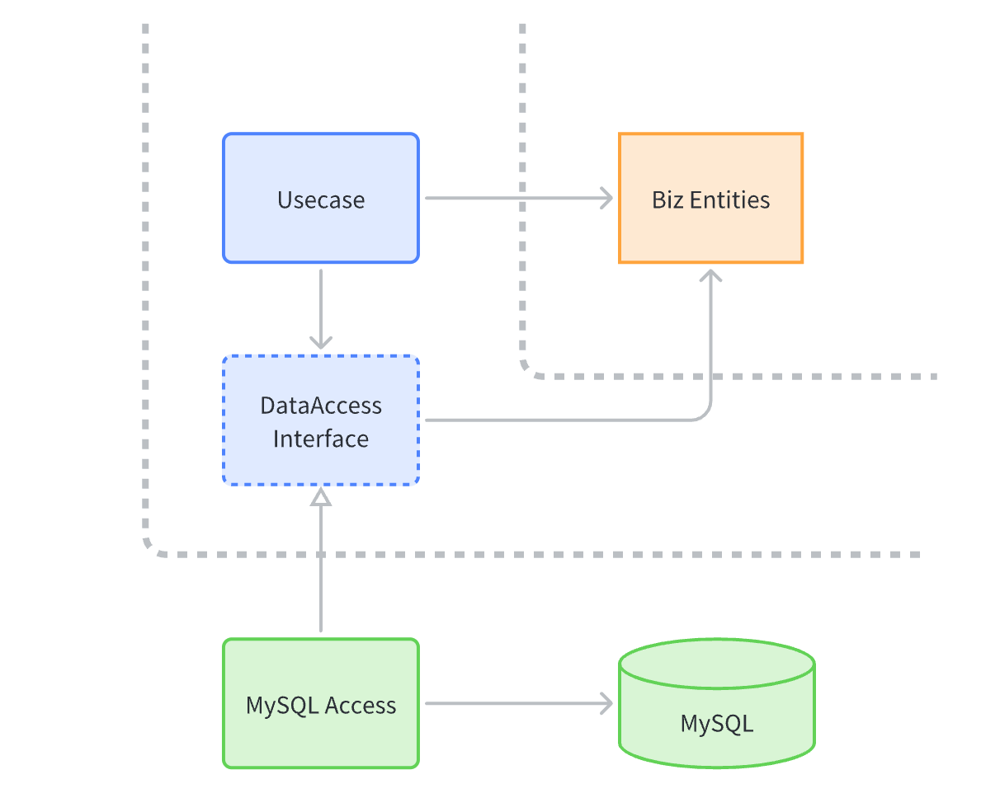
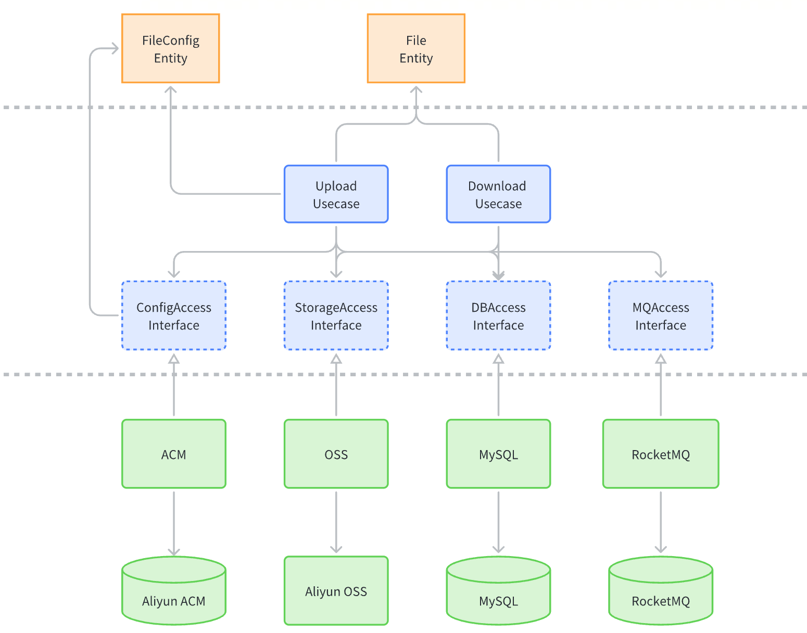

- 整洁架构
- DIP

## 整洁架构简介

> 直接上图
> 
> **整洁架构从外到内分为四层，源码中的依赖关系必须只指向同心圆的内侧，即由底层机制指向高层策略**

### 业务实体

这一层封装整个系统的关系业务逻辑，能被系统中的其他不同应用复用。
对应领域驱动设计中的概念就是领域模型。

### 用例

用例通常包含的是特定应用场景下的业务逻辑，这一层封装了整个系统所有用例。
这些用例引导了数据在业务实体之间的流入/流出，通过编排业务实体中的关键方法来实现业务用例的目标。

这一层发生的改变不应该影响业务实体，同时也不应该受外部因素（比如数据库、UI
框架）的影响。该层的变化应该只和应用本身的行为变化有关。

### 接口适配器

接口适配器层通常是一组数据转换器，负责将数据从对用例和业务实体最方便操作的格式转换为外部系统最方便的操作格式。例如这一层应该包含整个 GUI MVC 框架，展示器、视图、控制器都应该属于接口适配层，而模型部分则应该由控制器传给用例，用例再传回展示器和视图。

同样这一层也会负责将数据从对业务实体与用例方便的格式转换为数据持久化最方便的格式。

这一层也会负责将来自外部服务的数据转换为系统用例和业务实体所需的格式。

### 框架与驱动程序

这一层一般是由工具、工具、Web 框架等组成，包含了所有的实现细节，Web、数据库都是实现细节。
这一层也是最容易和频繁可能改变的，将其放在最外层就很难影响到其他层了。

## 依赖反转

代码如何保证整洁架构所约束的依赖关系原则呢，通常是通过依赖反转来实现。
比如需要将业务数据持久化，那直觉上来看肯定用例层需要调用接口适配层提供的数据库持久化方法，这就违反了只允许外层依赖内层的原则。

如上图所示，通过依赖反转，在用例层提供数据持久化需要的接口（Data Access Interface），由适配层提供具体的实现（MySQL Access），这样持久化时用例层不关注具体的实现，只需要调用用例层定义的接口即可。通过这种方法即将业务逻辑和具体的持久化方式解耦，又满足了只能外层依赖内层的原则。

## 应用示例

> 一个简单的文件存储服务，核心功能包括：文件上传、文件下载

组件依赖关系如下所示：

按照整洁架构的分层，简单分析上述文件存储服务 demo（上图省略了 Web 框架等处于最外层的组件）。

### 1. 实体层

实体层包含了两个核心实体：文件实体、文件配置实体。

- 文件实体：包含增、删、改查文件 DB 记录等方法，以及获取文件存储类型、存储 Key 的方法
- 文件配置实体：包含获取上传文件大小限制等配置的方法

### 2. 用例层

用例层包含了文件服务的两个核心业务用例：上传文件和下载文件，还包括了用于操作配置、数据库、对象存储、消息队列的一系列接口。

- 上传用例：调用文件配置实体获取上传配置，通过 StorageAccess 接口将文件内容持久化到对象存储或其他介质，再调用 DBAccess 的方法保存文件记录，最后通过 MQAccess 的方法发送一条上传文件的消息。
- 下载用例：调用文件实体的方法查询到文件的存储 Key，再调用 StorageAccess 的方法下载文件内容。

### 3. 接口适配层

接口适配层则实现了四个适配器。

- ACM: 用于管理动态配置
- OSS: 用于上传、下载文件对象
- MySQL: 用于增删改查文件记录
- RocketMQ: 用于发送文件上传消息

可以看到通过按照整洁架构的分层方式和依赖反转原则，文件服务的组件依赖关系非常清晰（图中三层只存在从下到上方向的依赖），而且将业务逻辑和存储介质等基础设施解耦，底层组件的替换完全不会影响到业务用例的逻辑。
