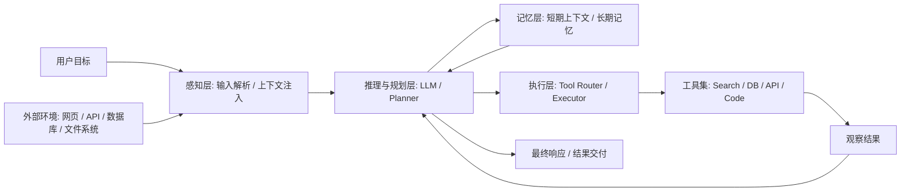
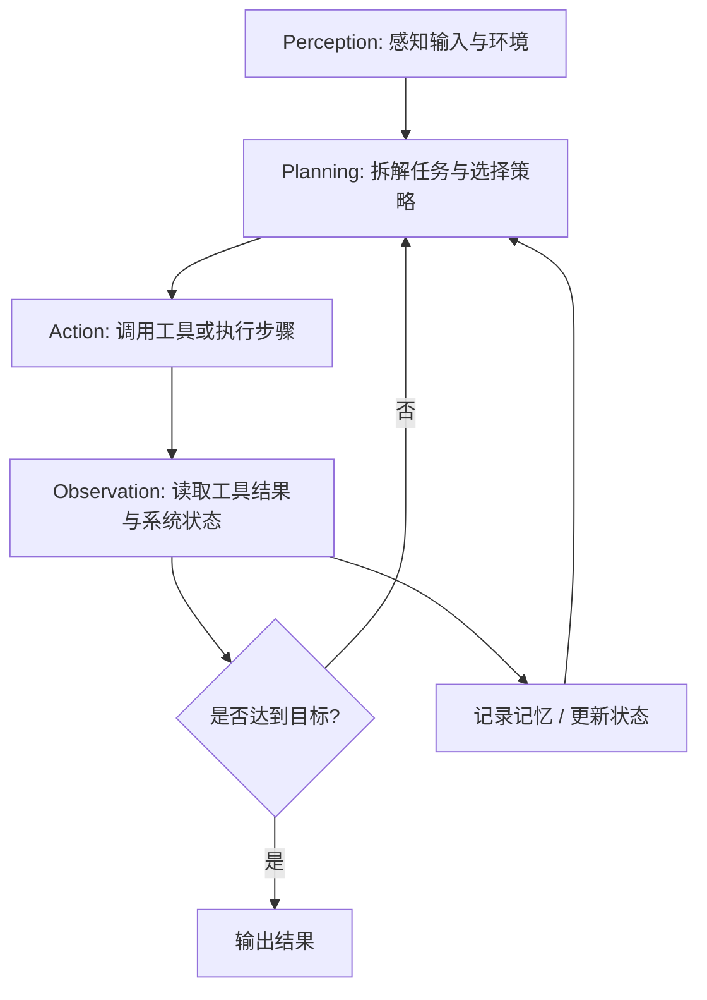
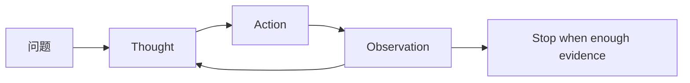

## 引言

大模型已经证明自己能“理解和生成语言”，但企业真正愿意为之付费的，通常不是一段漂亮回答，而是一个能把事情做完的系统。用户要的不是“解释怎么查机票”，而是“真的帮我查到、筛选好、提醒我、必要时还能下单”。

这正是 AI Agent 的价值所在。它不是单纯把提示词写得更长，而是围绕目标建立一条完整的执行闭环，让模型具备感知环境、规划步骤、调用工具、纠错复盘的能力。换句话说，Agent 让大模型从“语言接口”升级为“任务执行接口”。

本文不只讲概念，还会回答三个更实际的问题：

- AI Agent 到底比普通聊天机器人多了什么
- 一个能落地的 Agent 架构应该包含哪些模块
- 工程上应该从哪里开始做，才能避免一上来就陷入复杂系统

## 为什么需要 AI Agent

### 大模型本身已经很强，为什么还不够

LLM 在问答、总结、写作、翻译上的表现足够惊艳，但一旦进入真实业务流程，短板也会快速暴露：

- 知识是静态的，无法天然知道今天刚发生的事
- 只能“建议你去做什么”，却不能直接完成动作
- 输出受上下文和提示词强烈影响，稳定性不足
- 缺少持久状态，长任务容易中途“失忆”
- 很难对执行结果负责，通常没有显式的校验环节

这意味着，单纯的聊天模型更像一个能力很强的顾问，而不是一个真正的执行者。

### 一个业务视角的例子

假设你给系统一个目标：

> 帮我整理本周上海 AI Agent 线下活动，筛掉纯营销活动，按技术含量排序，并生成一段可发到群里的推荐文案。

如果只是 LLM，它最多给你一套“搜索建议”和一段模板文案；如果是 Agent，它会把任务拆成若干环节：

1. 搜索最新活动信息
2. 提取时间、地点、议题、主办方
3. 根据规则过滤活动质量
4. 生成排序结果
5. 输出最终推荐内容

差别不在“会不会写文案”，而在“能不能自己完成前面的事实收集与判断”。

### AI Agent 的核心价值

| 价值维度 | 体现方式 | 解决的核心问题 |
| --- | --- | --- |
| 自主性 | 目标驱动拆解任务并连续执行 | 用户不能为每一步都写提示词 |
| 可靠性 | 借助工具获取事实、执行校验、必要时回退 | 纯模型输出容易幻觉 |
| 可操作性 | 能调用搜索、数据库、邮件、日历、内部 API | 传统 LLM 只能停留在“建议”层 |
| 可扩展性 | 新增工具、记忆、流程后能力持续扩展 | 能力边界受模型本身限制 |
| 可治理性 | 可记录轨迹、评估结果、加入人审 | 业务系统需要可追责和可审计 |

## AI Agent 是什么

### 一个更准确的定义

AI Agent 是一个以大模型为推理核心、以工具调用为行动能力、以记忆和状态管理为支撑，并通过闭环执行完成目标的系统。

这个定义里有两个关键词最重要：

- 目标导向：不是围绕单轮问答，而是围绕结果交付
- 闭环执行：不是一次生成，而是“观察-决策-行动-反馈”的循环

### 一个最小可用架构



### 这几个组件分别做什么

| 组件 | 作用 | 常见工程实现 | 常见风险 |
| --- | --- | --- | --- |
| 感知 | 解析用户意图，补齐上下文 | Prompt 模板、输入规范化、多模态解析 | 用户目标理解偏差 |
| 推理 | 做判断、选择策略、生成下一步动作 | LLM、规则路由、规划器 | 推理成本高、路径漂移 |
| 记忆 | 保存状态、历史经验、业务知识 | 会话状态、RAG、向量库、KV 存储 | 召回噪音、旧信息污染 |
| 执行 | 把“计划”变成真实动作 | 函数调用、工作流引擎、任务编排器 | 参数错误、重试风暴 |
| 工具 | 提供外部能力边界 | 搜索、数据库、HTTP API、Shell | 权限失控、返回结构不稳定 |
| 评估 | 判断结果是否可接受 | 规则校验、模型评审、人审 | 缺少验收标准 |

## 工作原理：PPA 闭环

很多文章会把 Agent 的行为概括成“感知-规划-行动”，这是对的，但在工程上更准确的理解应该是一个持续运行的反馈环。



### 在工程里，PPA 循环通常会变成 6 个问题

1. 当前目标是什么
2. 还缺哪些信息
3. 下一步是思考还是行动
4. 要调用哪个工具，参数是什么
5. 工具返回是否可信，是否需要重试
6. 什么时候停下来并交付结果

这 6 个问题回答得越清楚，Agent 的行为就越稳定。

## 从 ReAct 到 Plan-and-Execute：常见思考框架

Agent 不只是“会调工具”，它还需要一种决策模式。不同框架的本质，是在“灵活性、成本、稳定性”之间做权衡。

### 1. CoT：适合短链路推理

思维链（Chain of Thought）强调把复杂问题拆成中间推理步骤。优点是解释性强，适合数学、逻辑和简单分析，但它并不天然包含外部行动。

### 2. ReAct：适合动态探索型任务

ReAct 把推理和行动交替起来：先想，再做，再看结果，再继续想。只要任务依赖实时信息、外部工具、环境反馈，ReAct 就比纯 CoT 更实用。



### 3. Plan-and-Execute：适合长流程、强约束任务

如果一个任务步骤比较固定，比如“写周报 -> 拉数据 -> 生成图表 -> 发邮件”，先做全局计划再逐步执行，通常比让模型边想边试更稳定。

| 框架 | 决策方式 | 优点 | 局限 | 适用场景 |
| --- | --- | --- | --- | --- |
| CoT | 线性推理 | 成本低、易解释 | 不擅长真实行动 | 问答、分析、简单决策 |
| ReAct | 动态迭代 | 灵活、能处理环境变化 | 轨迹可能发散 | 搜索、调研、故障排查 |
| Plan-and-Execute | 先规划后执行 | 结构清晰、适合长任务 | 前期规划错误会连锁影响 | 固定流程、企业任务自动化 |

一个常见误区是“所有任务都用最复杂框架”。现实里更好的做法是：能单步完成的，别做多轮；能规则化的，别把一切都交给模型。

## 一个最小可运行的 Agent 示例

下面这个例子用 Python 演示一个极简 Agent Loop。它没有引入复杂框架，但已经具备了“读取目标、决定动作、调用工具、继续迭代”的基本形态。

```python
from typing import Any


TOOLS = {
    "search_events": lambda city, topic: [
        {"title": "Agent Meetup", "city": city, "topic": topic, "score": 0.82},
        {"title": "Marketing Expo", "city": city, "topic": topic, "score": 0.28},
    ],
    "filter_events": lambda items: [item for item in items if item["score"] >= 0.6],
}


def call_model(goal: str, state: dict[str, Any]) -> dict[str, Any]:
    if "events" not in state:
        return {
            "type": "tool",
            "tool": "search_events",
            "args": {"city": "上海", "topic": "AI Agent"},
        }
    if "filtered" not in state:
        return {
            "type": "tool",
            "tool": "filter_events",
            "args": {"items": state["events"]},
        }
    return {
        "type": "final",
        "content": f"本周推荐活动：{state['filtered']}",
    }


def run_agent(goal: str) -> str:
    state: dict[str, Any] = {"goal": goal, "trace": []}

    for _ in range(6):
        step = call_model(goal, state)
        state["trace"].append(step)

        if step["type"] == "final":
            return step["content"]

        tool = TOOLS[step["tool"]]
        result = tool(**step["args"])

        if step["tool"] == "search_events":
            state["events"] = result
        elif step["tool"] == "filter_events":
            state["filtered"] = result

    raise RuntimeError("Agent exceeded max iterations")
```

这个例子看起来很简单，但已经体现了 Agent 的三个关键点：

- 目标不是“一次生成”，而是持续推进状态
- 模型输出的不是最终答案，也可能是下一步动作
- 工具结果会反过来影响后续决策

真正的生产系统，只是在这条链路上再加入权限控制、重试、日志、评估和人审而已。

## 记忆系统：没有状态，Agent 很难进入生产环境

很多 Agent Demo 之所以“看起来聪明、实际不稳”，核心原因不是模型不够强，而是状态设计太弱。

### 短期记忆：让单次任务不断片

短期记忆通常包括：

- 最近几轮对话
- 工具调用结果
- 当前任务计划
- 失败原因和重试记录

这部分更像工作内存，目标是让模型知道“我刚才做到了哪一步”。

### 长期记忆：让系统跨任务持续复用

长期记忆则更偏向知识层和经验层：

- 用户偏好
- 历史案例
- 业务规则
- 常见异常处理策略

常见实现方式包括向量检索、知识库、结构化数据库。要注意的一点是：长期记忆不是“存得越多越好”，而是“召回要准、版本要可控、过期要能淘汰”。

## 工具使用：Agent 是否能落地，关键看这里

工具是 Agent 的能力边界。一个不会调用工具的 Agent，本质上仍然是对话机器人。

### 常见工具类型

- 信息获取：搜索、网页抓取、数据库查询
- 系统操作：发邮件、发消息、建工单、写文档
- 计算与生成：代码执行、表格处理、图像处理
- 企业接入：CRM、ERP、知识库、内部 API

### 工具设计的三个原则

1. 返回结构化结果，而不是大段自由文本
2. 参数要少而明确，避免模型拼装复杂输入
3. 每个工具都要有失败语义，便于重试和回退

例如，一个好的工具接口更像这样：

```json
{
  "tool": "create_ticket",
  "args": {
    "title": "支付回调异常",
    "priority": "high",
    "assignee": "oncall"
  }
}
```

而不是让模型直接“写一段给工单系统看的自然语言说明”。

## AI Agent 的架构演进

过去两年，Agent 架构大致经历了三个阶段：

### Level 1：Prompt-based Agent

核心是角色设定和提示词编排。适合演示和轻量助手，但执行能力弱，容易在复杂任务中失控。

### Level 2：Tool-augmented Agent

开始形成经典结构：

`Agent = LLM + Memory + Planning + Tools`

这也是今天大部分生产实践的主流形态。它不追求“完全自主”，而是追求“在可控范围内把事做成”。

### Level 3：Multi-Agent System

把不同职责拆给多个 Agent，例如调研 Agent、编码 Agent、审查 Agent、发布 Agent。优点是专业化和并行化更强，缺点是治理复杂度、通信成本和观测难度都会明显上升。

| 阶段 | 典型能力 | 优势 | 主要问题 |
| --- | --- | --- | --- |
| Prompt-based | 角色扮演、问答、写作 | 上手快 | 不能稳定执行任务 |
| Tool-augmented | 工具调用、状态管理、闭环执行 | 可落地 | 需要严谨的工程设计 |
| Multi-Agent | 分工协作、并行执行、人机协同 | 复杂任务处理更强 | 调度和治理成本更高 |

## 落地建议：先做成，再做大

如果你准备在团队里真正做一个 Agent，建议先遵循下面这条路线：

### 1. 从单 Agent + 少量高价值工具开始

先挑一类边界清晰、收益明确的任务，比如：

- 客服知识检索
- 销售线索整理
- 研发工单分流
- 周报/日报生成

不要一开始就追求“通用数字员工”。

### 2. 先定义验收标准，再写提示词

很多项目失败，不是模型不行，而是“什么叫做好结果”从未定义过。你至少要先明确：

- 成功率怎么衡量
- 哪些错误不能接受
- 何时必须人工接管
- 是否需要保留完整执行轨迹

### 3. 给 Agent 加上护栏

护栏不只是安全问题，也包括稳定性问题：

- 最大迭代次数
- 工具权限白名单
- 高风险操作二次确认
- 失败重试与熔断
- 结果校验与人审

### 4. 把可观测性当成一等公民

一旦进入生产环境，你最需要的不是“模型为什么这么聪明”，而是“这一步为什么失败”。因此要保留：

- 用户输入
- 中间推理摘要
- 工具调用参数
- 工具返回结果
- 最终验收状态

没有这些日志，Agent 系统几乎无法调优。

## 结语

AI Agent 的意义，不在于把大模型包装成一个更炫的聊天界面，而在于把“语言理解”扩展为“目标执行”。理解它的核心组件、PPA 闭环、思考框架和工程护栏，你就能判断一个 Agent 是停留在 Demo，还是已经具备进入真实业务流程的条件。

真正值得投入的方向，从来不是“让模型再说得像人一点”，而是“让系统能更稳定地把事做完”。
