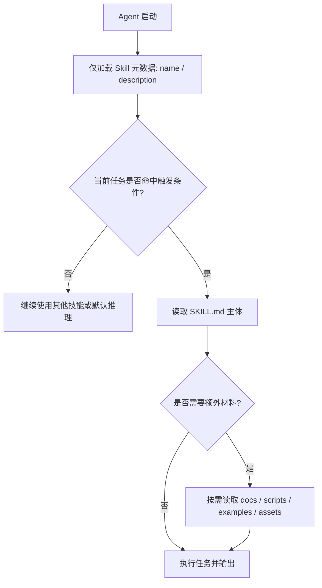
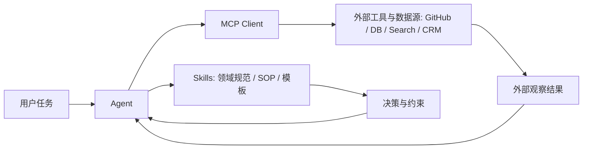
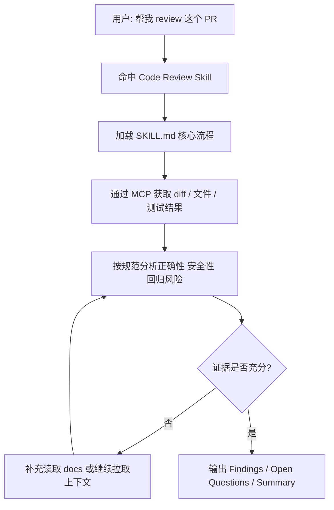

## 引言：为什么 Agent 越强，越需要 Skills

一个常见误解是：模型能力越强，工程封装就越不重要。事实恰好相反。越是能力强的 Agent，越容易被投喂进更复杂、更高风险的业务环境；这时候系统真正缺的，往往不是“再多一点常识”，而是稳定、可复用、可治理的专业操作能力。

这就是 Skills 的定位。它不是一句更长的 System Prompt，也不是某个工具接口的别名，而是一种把领域知识、执行规范、最佳实践和辅助资源组织起来的工程化封装。

如果说 MCP 负责把 Agent 接入真实世界，那么 Skills 负责告诉 Agent：在这个世界里，应该怎么做才算专业、稳妥、符合团队标准。

## Skills 到底是什么

### 先说结论

Skills 本质上是一种面向 Agent 的能力包，它通常包含：

- 触发条件：什么场景下应该启用这个 Skill
- 操作规范：任务应该如何拆解和执行
- 外部资源：示例、模板、脚本、参考文档
- 约束条件：哪些动作不能做，哪些结果必须校验

它解决的不是“模型会不会”，而是“模型在特定场景下能不能稳定做到团队想要的方式”。

### 它不是什么

为了避免概念混淆，也可以先明确 Skills 不是什么：

- 不是单纯的提示词模板
- 不是工具本身
- 不是工作流引擎
- 不是知识库的别名

Skills 更像一份带执行入口的标准作业程序。它既能描述“该怎么做”，又能告诉 Agent“需要时去哪里拿工具、文档和样例”。

## 为什么 System Prompt 不够

很多团队最初会把规范全塞进系统提示词，例如：

- 代码审查要检查安全性、性能、可维护性
- 客服回复必须遵守品牌语气
- 法务问答不能给确定性法律结论

这种做法短期有效，但一旦任务变复杂，问题就会出现：

- 提示词越来越长，上下文成本持续膨胀
- 多领域规范互相污染，模型难以聚焦
- 团队标准更新后，难以统一维护
- 很难做到按需加载和版本管理

Skills 的出现，本质上是把“写死在提示词里的领域能力”模块化、文件化、可演进化。

## 一个 Skill 通常长什么样

### 目录结构：一个“会说话”的能力包

```text
my-company-code-reviewer/
├── SKILL.md
├── docs/
│   ├── review-rubric.md
│   └── security-baseline.md
├── scripts/
│   └── collect_diff.sh
├── examples/
│   └── good-review.md
└── assets/
    └── checklist.yaml
```

各目录承担的职责通常如下：

- `SKILL.md`：Skill 入口，说明何时触发、如何执行、需要再读取哪些资源
- `docs/`：规则、背景知识、SOP、术语解释
- `scripts/`：辅助执行的脚本或自动化工具
- `examples/`：成功案例、输出模板、少量高价值示例
- `assets/`：结构化配置，如检查清单、分类标签、评分规则

### Skill 的核心入口：`SKILL.md`

一个可维护的 Skill，关键不在目录多复杂，而在入口文件是否把“触发条件”和“执行路径”写清楚。

```yaml
---
name: my-code-reviewer
description: Review code changes against team standards. Use when asked to review code, audit a PR, or summarize engineering risks.
---
```

下面是一个更接近工程实践的 `SKILL.md` 片段：

```markdown
# Code Review Skill

Use this skill when the user asks for code review, PR audit, or change risk assessment.

## Goals

- Identify correctness, security, and regression risks
- Prioritize findings by severity
- Keep summaries brief and action-oriented

## Workflow

1. Read the changed files and commit context
2. Load `docs/review-rubric.md` when team standards are needed
3. Run `scripts/collect_diff.sh` if a diff summary is required
4. Compare implementation against examples in `examples/good-review.md`
5. Output findings first, then open questions, then summary

## Guardrails

- Do not approve code without checking tests
- Do not speculate about behavior that is not supported by the diff
- Call out missing tests explicitly
```

### 一句话理解

`SKILL.md` 不是“给模型看的说明书”那么简单，它更像 Agent 的战术卡片：什么时候出场、按什么流程推进、需要调用哪些资源、哪些边界不能越过。

## Skills 的关键机制：渐进式披露

如果把所有技能内容一次性塞进上下文，大模型很快会被撑爆，成本和噪音也会同步上升。Skills 真正重要的设计点，在于“按需加载”。



这种“渐进式披露”有三个直接收益：

- 控制上下文成本，避免所有规范同时进入对话
- 支持大规模技能库共存，而不相互干扰
- 让复杂能力以模块形式演进，便于治理和复用

从工程角度看，这和传统软件里的“懒加载”非常类似。不是系统没有这些能力，而是只有在相关场景真正出现时，才把它们调入工作内存。

## Skills、Tools、Workflow、MCP 分别是什么

这一块最容易混淆，建议直接区分成四层：

| 层级 | 回答的问题 | 典型形式 |
| --- | --- | --- |
| Skills | 这类事应该怎么做 | 规范、SOP、模板、示例、脚本入口 |
| Tools | 我现在可以做什么动作 | 搜索、数据库、HTTP API、Shell、业务接口 |
| Workflow | 多个步骤如何编排 | 状态机、DAG、任务编排器 |
| MCP | 这些工具和数据如何标准化接入 | Server、Protocol、Client |

一句话概括：

- Skills 定义 `What good looks like`
- Tools 提供 `What can be done`
- Workflow 负责 `In what order`
- MCP 解决 `How to connect`

## Skills 与 MCP：为什么说它们是天然互补的

MCP 让 Agent 能够访问外部世界，例如代码仓库、数据库、浏览器、内部系统；Skills 则负责补上“领域方法论”，避免 Agent 拿到工具后仍然凭感觉乱做事。



### 一个更形象的比喻

- MCP 像冰箱、炉灶、刀具，解决“有没有能力做”
- Skills 像菜谱和厨师手册，解决“怎样做才专业”

只有工具没有 Skill，Agent 会做，但不一定做得对；只有 Skill 没有工具，Agent 知道该怎么做，但手伸不出去。

## 一个代码审查案例：三种模式的差距

为了更直观，下面用“代码审查”这个典型场景来对比三种模式。

### 模式一：只有 MCP

Agent 能连接代码仓库、拉取 diff、查看测试结果，但因为没有团队规范，它通常只能输出一份比较泛化的审查意见：

- 可能指出命名、格式、空指针等常规问题
- 很难知道团队是否强调回滚风险、兼容性、灰度发布
- 不知道输出格式是否要“先结论、后细节”

结果是“看起来会审查”，但很难满足真实团队标准。

### 模式二：只有 Skills

Agent 知道这家团队要求：

- Findings 要按严重级别排序
- 必须优先关注行为回归和安全风险
- 没有测试时必须明确指出

但它拿不到代码上下文，只能依赖用户粘贴内容。规范是有了，执行却很吃力。

### 模式三：Skills + MCP

这才是最接近生产可用的组合：

1. Skill 告诉 Agent 应该先找高风险问题，再关注次要问题
2. MCP 帮它拉取 PR diff、测试结果、相关文件
3. Agent 按 Skill 规定的格式输出 findings
4. 必要时再读取 `docs/review-rubric.md` 做更细颗粒度判断



这一模式的本质，不是“把两个概念拼一起”，而是把“方法论”和“执行能力”真正闭环起来。

## 一个最小 Skill 示例

如果你要为团队做第一个 Skill，下面这种粒度通常就够了。

```markdown
---
name: weekly-report-writer
description: Draft weekly status reports from project notes and task updates. Use when asked to summarize weekly progress or prepare a status email.
---

# Weekly Report Writer

## Inputs

- Project notes
- Task updates
- Risks or blockers

## Workflow

1. Summarize shipped work first
2. Group remaining items by project
3. Highlight blockers separately
4. Keep tone concise and executive-friendly

## Output Format

- This week
- Next week
- Risks
```

这个 Skill 不复杂，但已经具备了三个必要条件：

- 触发场景明确
- 流程明确
- 输出格式明确

对于大多数团队来说，先把这三点写清楚，比追求一套“很先进但没人维护的技能平台”更重要。

## 如何判断一个 Skill 写得好不好

一个高质量 Skill 往往有下面几个特征：

### 1. 触发条件清晰

如果 `description` 太泛，比如“用于所有写作任务”，那它几乎一定会误触发。好的触发描述通常包含：

- 任务类型
- 典型意图
- 明显边界

### 2. 执行步骤是可操作的

“请专业地完成任务”不是步骤；“先读取 diff，再对照规范，再输出 findings”才是步骤。

### 3. 依赖资源是按需的

不要把所有背景材料都塞进正文，应该明确告诉 Agent：

- 什么时候看 `docs/`
- 什么时候运行 `scripts/`
- 什么时候参考 `examples/`

### 4. 输出标准可验证

Skill 最怕“只告诉模型做什么，不告诉它结果怎么算好”。因此最好显式定义：

- 输出结构
- 禁止行为
- 质量要求
- 升级人工的条件

## 常见反模式

下面这些问题在真实项目里非常常见：

| 反模式 | 结果 |
| --- | --- |
| 把 Skill 写成一段超长散文 | 模型抓不到重点，触发和执行都不稳定 |
| 一个 Skill 覆盖太多场景 | 复用性看似提高，实际准确率下降 |
| 只写“应该做什么”，不写“怎么做” | Agent 依旧靠临场发挥 |
| 依赖外部资料但不说明何时读取 | 要么漏读，要么全量读爆上下文 |
| 没有边界约束 | 高风险场景容易输出错误结论 |

简化理解就是：Skill 不是知识堆积，而是能力编排。

## 实践建议：如何在团队中落地 Skills

### 1. 先从高频、文本密集、规范明确的任务开始

例如：

- 代码审查
- 客服回复
- 周报生成
- 会议纪要整理
- 售前答复模板化

这类任务最容易沉淀出可复用规范。

### 2. Skill 尽量小而专

不要一开始就做“研发全能助手”。更好的思路是：

- 一个 Skill 解决一个稳定场景
- 每个 Skill 都有清晰边界
- 复杂任务通过多个 Skill 组合

### 3. 把版本化和评估提早做起来

如果团队真的开始依赖 Skills，就必须把它们当成正式资产管理：

- 谁负责维护
- 什么时候更新
- 更新后怎么验证效果
- 是否需要回滚机制

### 4. 用 Skill 固化经验，而不是复制文档

很多团队会犯一个错误：把内部文档原样塞进 Skill。这样做的结果，通常是信息很多，但 Agent 不知道哪些最重要。

正确做法是把经验“压缩成行动规则”，再把文档作为按需参考资料挂上去。

## 结语

Skills 的真正价值，不在于给 Agent 多加一层包装，而在于把“领域经验、执行规范、质量要求”从一次性提示词中剥离出来，变成可复用、可版本化、可治理的能力模块。

当 Agent 开始深入业务系统时，光有工具接入远远不够。它还需要知道什么时候该谨慎、先做什么、后做什么、结果要长成什么样。MCP 解决的是“连得上”，Skills 解决的是“做得对”。两者结合，才是 Agent 从 Demo 走向生产系统的关键一步。
