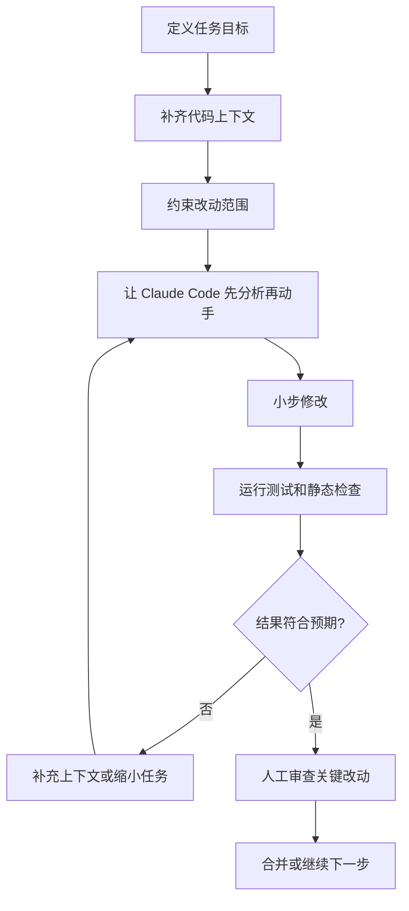
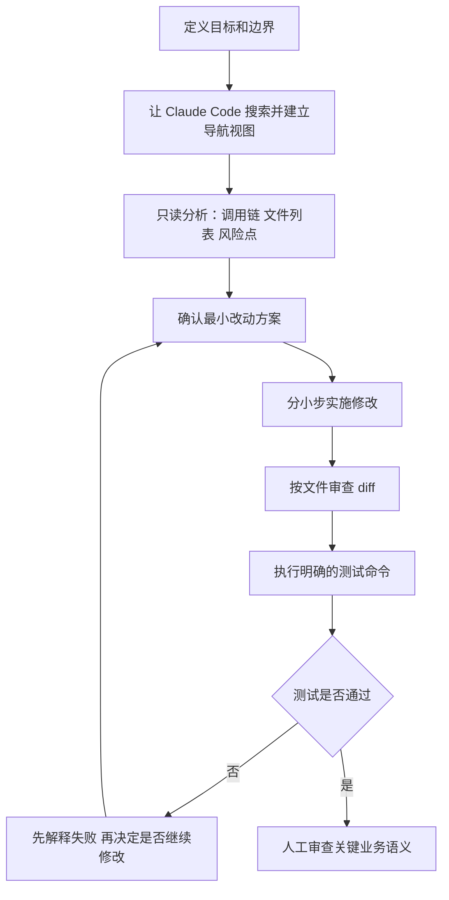

## 引言：问题不在“能不能写代码”，而在“能不能稳定协作”

很多人第一次用 Claude Code 时，感受都很强烈：它能读仓库、能改代码、能跑命令，速度往往比手写快得多。但一旦任务变复杂，体验很容易从“真好用”滑向“为什么它又改偏了”。

问题通常不在模型会不会写代码，而在协作方式不对。把 Claude Code 当成一个会自动补全的大号 IDE 插件，往往会得到一堆方向正确、细节失控的改动；把它当成一个需要上下文、边界和验收标准的工程搭档，结果会稳定很多。

这篇文章会分两层来讲：

- 第一层是通用协作原则，也就是如何把 AI 编码从“Vibe Coding”拉回工程化协作
- 第二层是 Claude Code 工具本身的使用技巧，包括如何读仓库、如何下指令、如何控制命令和改动粒度、如何做 diff 与测试收口

只有这两层结合起来，Claude Code 才更像可靠的编码搭档，而不是偶尔灵、偶尔失控的黑盒。

## 先说结论：Claude Code 最适合做什么

Claude Code 并不是对所有任务都同样高效。下面这张表更接近实际使用体验。

| 任务类型 | 适合度 | 原因 | 建议做法 |
| --- | --- | --- | --- |
| 小到中等规模重构 | 高 | 需要跨文件理解，但目标相对清晰 | 明确范围、先看调用链、分批提交 |
| Bug 排查与修复 | 高 | 能快速阅读日志、代码路径和测试 | 先复现，再定位，再修复，再验证 |
| 新功能脚手架 | 高 | 重复性高，容易模板化 | 先定接口和目录结构，再生成骨架 |
| 代码审查与风险扫描 | 高 | 擅长从 diff 中找遗漏点 | 先看改动，再按正确性/风险排序 |
| 大型架构迁移 | 中 | 需要长期决策和业务知识 | 切成阶段任务，不要一次性全改 |
| 需求含糊的新系统设计 | 中低 | 模糊目标会放大错误假设 | 先人工收敛，再让它输出方案 |
| 安全、账务、权限核心逻辑 | 谨慎使用 | 这里错一次成本就很高 | 可以辅助，但必须人工逐段审查 |

一个简单原则是：

- 目标越清晰，Claude Code 越稳定。
- 反馈越及时，Claude Code 越像助手而不是风险源。
- 改动越可验证，Claude Code 的收益越高。

## 一个好结果通常长什么样

如果把一次高质量协作抽象成流程，大致是下面这样：



关键不是“让它一次做完”，而是形成一个可纠偏的闭环。

## 通用协作最佳实践

### 最重要的实践一：先把任务写成工程问题，而不是聊天问题

很多低质量输出，都来自低质量任务描述。下面两种说法，看起来只是语气不同，实际效果差很多。

#### 不好的提法

```text
帮我优化一下这个项目。
```

这类请求的问题在于：

- 没有目标，Claude Code 不知道你要性能、可维护性还是可读性
- 没有范围，它可能跨很多文件做不必要改动
- 没有验收标准，最后很难判断是否真的“优化”

#### 更好的提法

```text
请检查 users service 的注册流程，目标是减少重复校验逻辑。
限制在 service 和 validator 两层，不改 API 结构。
修改后运行相关测试，并说明是否有行为变化。
```

这类任务描述至少给了它四件关键东西：

- 目标：减少重复校验逻辑
- 范围：`service` 和 `validator`
- 禁区：不改 API 结构
- 验收：运行测试，说明行为变化

这时 Claude Code 才更像在执行任务，而不是在猜用户心思。

### 最重要的实践二：先让它分析，再让它修改

直接说“去改”，往往会跳过最贵的一步：建立正确的问题模型。

更稳妥的方式是分成两轮：

1. 先让 Claude Code 解释它理解到的现状、依赖关系和可能方案
2. 你确认方向后，再让它开始改

这个过程看起来多了一步，实际通常能省掉后面更多返工。

#### 推荐的起手式

```text
先不要改代码。先阅读与订单超时取消相关的实现，回答三个问题：
1. 超时状态当前在哪里计算
2. 哪些入口会触发取消逻辑
3. 如果要把超时阈值改成按商户配置，最小改动方案是什么
```

这类提问有两个好处：

- 你可以先判断它是否真的读懂了代码
- 你能在动手前修正它的错误假设

对于复杂任务，这一步几乎总是值得。

### 最重要的实践三：控制改动半径，避免“一次改完整个仓库”

Claude Code 最大的优势之一是跨文件理解，最大风险之一也是跨文件理解。它很容易顺着一条线索把相关代码都改了，但工程上“能改到”不等于“应该改到”。

#### 推荐做法

- 一次只解决一个明确问题
- 优先限制目录、模块或层级
- 明确哪些文件允许改，哪些文件不能碰
- 大任务拆成“分析 -> 骨架 -> 细化 -> 验证”几个阶段

#### 一个典型拆分方式

| 阶段 | 目标 | 让 Claude Code 做什么 | 不要做什么 |
| --- | --- | --- | --- |
| 现状分析 | 弄清调用链和边界 | 阅读代码、总结依赖、找影响面 | 直接提交大改 |
| 骨架修改 | 建立基础结构 | 建接口、补类型、留 TODO | 顺手重构 unrelated 代码 |
| 逻辑补全 | 实现核心行为 | 补业务分支、补错误处理 | 额外改命名和风格 |
| 验证收尾 | 确认结果可靠 | 跑测试、补测试、解释差异 | 继续扩需求 |

工程实践里，一个常见失误是让它在修 bug 时顺带“统一风格”“顺便重构”“把旧逻辑也整理一下”。这些额外目标会迅速拉高不确定性。

### 最重要的实践四：上下文要够，但不要噪音过多

Claude Code 需要上下文，但不是越多越好。有效上下文应该服务于当前任务，而不是把整个仓库历史塞给它。

#### 真正高价值的上下文

- 任务涉及的入口文件和核心调用链
- 相关测试或失败日志
- 当前预期行为与目标行为的差异
- 团队约束，例如 API 兼容、数据库字段不能变、必须保留幂等性

#### 低价值甚至有害的上下文

- 大段无关业务背景
- 整个项目目录树
- 没有筛选的超长报错日志
- 与当前任务无关的历史讨论

可以把高质量上下文理解为：让 Claude Code 快速建立“局部真实世界”，而不是让它被信息淹没。

### 最重要的实践五：让它输出“计划和风险”，不是只输出代码

如果你只让 Claude Code 给结果，它往往也只给结果；而真实工程协作需要的不只是 diff，还包括判断依据。

比较实用的要求包括：

- 先给出修改计划
- 标出可能受影响的模块
- 说明是否存在行为变更
- 如果有不确定点，显式列出来

#### 推荐提示词模板

```text
请先给出修改计划，不要直接动手。
输出内容包含：
1. 你准备修改哪些文件
2. 每个文件改动的目的
3. 哪些地方可能引入回归
4. 你打算用什么方式验证
```

这能把“隐式推理”部分外显出来，方便你在真正写入代码前做一次低成本审查。

### 最重要的实践六：测试不是收尾动作，而是任务的一部分

很多人会在 Claude Code 改完之后，才想起“顺便跑下测试”。这个顺序不够稳。更好的做法是，从一开始就把验证条件放进任务定义里。

#### 更合理的闭环


#### 实践建议

- 修 bug 时，优先先补一个能复现问题的测试
- 做重构时，要求它说明“行为不变”的证据
- 如果测试跑不过，不要只要它“再试一次”，先让它解释失败原因
- 对关键路径，要求它列出未覆盖的风险点

一个很有效的提法是：

```text
如果你认为修改完成，请先运行相关测试。
如果测试失败，不要继续盲改，先总结失败原因和下一步计划。
```

这能显著减少“为了让测试绿掉而乱修”的情况。

### 最重要的实践七：把 Claude Code 当成结对工程师，而不是自动提交机

高质量使用方式更像 pair programming，而不是把需求扔进去等结果。

#### 一个比较稳的协作节奏

1. 你定义目标、范围和约束
2. Claude Code 读代码并给出理解
3. 你确认方向，纠正误解
4. Claude Code 小步修改并执行验证
5. 你做关键审查，尤其是业务语义和边界条件

真正应该人工重点看的地方，通常是：

- 业务规则是否被误解
- 错误处理是否符合线上约束
- 幂等性、兼容性、权限判断是否被破坏
- 测试是否真的验证到了关键路径

如果任务本身很敏感，最稳的方式不是禁用 Claude Code，而是把它限制在“分析 + 草稿 + 局部修改”的角色。

## Claude Code 工具使用技巧

前面的内容更偏协作原则。下面这一部分，聚焦 Claude Code 自身的产品特性。这里提到的 `/` 指令、Plan Mode、Subagents、Memory、Permissions 和 MCP，都来自 Anthropic 官方 Claude Code 文档；这些内容会变，所以下面的描述以 2026 年 3 月 8 日查到的官方文档为准。

### 技巧一：先把内置 `/` 指令当成主界面，而不是只会自然语言对话

很多人把 Claude Code 只当成“终端里的聊天框”，这是最可惜的用法。Claude Code 有一组内置 slash commands，本质上就是它的操作面板。

比较常用的一组包括：

- `/help`：快速查看当前可用指令
- `/init`：为项目初始化 `CLAUDE.md`
- `/memory`：查看或编辑记忆文件
- `/permissions`：查看和修改权限策略
- `/config`：查看和调整配置
- `/review`：发起代码审查
- `/agents`：管理自定义 Subagents
- `/mcp`：管理 MCP 连接
- `/compact`：压缩当前会话上下文
- `/clear`：清空对话历史
- `/add-dir`：给当前会话添加更多工作目录

实际使用里，一个很大的分水岭是：你是在“给 Claude 发一句话”，还是在“用 Claude Code 的原生命令切换工作模式”。后者通常更稳定。

### 技巧二：复杂任务先切到 Plan Mode，而不是直接进入改写状态

根据官方文档，Plan Mode 是 Claude Code 的只读分析模式，适合做代码探索、复杂变更规划和安全审查。它的核心价值不是“更聪明”，而是“先分析，不落盘”。

这非常适合三类场景：

- 你还不确定改动方向，只想先摸清代码路径
- 任务影响面大，想先拿到修改计划
- 你在 review 或排障，不希望会话过程中直接写文件或执行高风险命令

如果你在交互模式里工作，可以通过切换权限模式进入 Plan Mode；如果你走 CLI，也可以显式指定 `--permission-mode plan`。

一个很实用的习惯是：

1. 先用 Plan Mode 让 Claude Code 读仓库、列风险、给方案
2. 方向确认后，再切回正常编辑模式实施修改

这样比“边看边改”更符合复杂任务的节奏。

### 技巧三：把 `/compact` 当成长会话的收纳工具，而不是等上下文炸了再补救

Claude Code 在长任务里很容易积累大量上下文：命令输出、diff、测试结果、来回试探的方案。上下文越长，后续回复越容易带着历史噪音。

`/compact [instructions]` 的价值就在这里。它可以压缩会话，并允许你加一段聚焦说明，例如：

```text
/compact 只保留订单超时取消改造的现状、已确认约束、剩余待办和测试失败原因
```

这个命令适合在几个时点使用：

- 已经完成一轮分析，准备开始真正编码
- 已经完成一轮编码，准备进入测试和收尾
- 会话太长，开始出现重复说明或跑偏迹象

如果你长期做大任务，不主动使用 `/compact`，Claude Code 的表现往往会越来越像“记了很多，但抓不住重点”。

### 技巧四：用 `/memory` 和 `CLAUDE.md` 把项目约束前置，而不是每次重复口头交代

Claude Code 有正式的 memory 机制。官方文档里提到它至少有项目级 `./CLAUDE.md`、用户级 `~/.claude/CLAUDE.md`，以及企业级 memory；其中项目级最适合团队共享约束。

这个机制特别适合沉淀以下内容：

- 项目常用命令：build、test、lint、dev
- 关键架构约束：哪些层不能跨越、哪些目录不能直接依赖
- 代码风格与命名约定
- 常见工作流：改接口先补契约测试、改 SQL 先看迁移脚本

官方文档还提到，`CLAUDE.md` 支持用 `@path` 导入其他文件，`/memory` 可以直接查看和编辑当前加载的 memory 文件。

工程上更推荐的用法不是把所有要求都堆在 prompt 里，而是：

- 共享规则进 `./CLAUDE.md`
- 个人偏好放 `~/.claude/CLAUDE.md`
- 会话里临时新增的稳定规则，再通过 `#` 快速写入 memory

这样同一个项目里的多次会话会稳定很多。

### 技巧五：把自定义 slash commands 当成团队 SOP，而不是 prompt 模板小抄

官方文档里，Claude Code 支持项目级和用户级自定义 slash commands：

- 项目级放在 `.claude/commands/`
- 用户级放在 `~/.claude/commands/`

它们不是简单文本替换，而是可带 frontmatter 的 Markdown 命令文件，支持：

- `description`
- `argument-hint`
- `allowed-tools`
- `model`
- `$ARGUMENTS`、`$1`、`$2` 这样的参数占位
- `@file` 文件引用

这意味着你可以把高频流程固化成真正的命令，例如：

- `/review-backend`
- `/fix-test <case>`
- `/security-check`
- `/prepare-pr`

相比每次手写一长段 prompt，这种方式的优点很明显：

- 团队成员共享同一套入口
- 参数格式更固定，不容易漏信息
- 可以限制允许使用的工具，降低误操作风险

如果你的团队已经有固定 SOP，自定义 slash commands 往往比“口口相传的提示词”更靠谱。

### 技巧六：把 Subagents 用在“明确分工”上，而不是把所有任务都丢给主 Agent

Anthropic 官方把 Subagents 描述为“带独立上下文窗口、特定工具权限和专用 system prompt 的专门化助手”。这是 Claude Code 很有代表性的能力，不是普通聊天助手的默认配置。

Subagents 特别适合这些场景：

- 一个负责代码审查，一个负责测试补全
- 一个专门看前端可访问性，一个专门看后端性能
- 一个只负责 release notes、PR summary 这类收尾工作

这项能力最大的工程价值有两个：

- 分工清楚，主会话上下文不会被所有细节塞满
- 可以给不同子 Agent 配不同工具权限，减少误用

如果主会话既要读架构、又要补测试、又要写 PR 总结，信息很容易打结；拆成 Subagents 后，Claude Code 更像一个能委派任务的工作台。

### 技巧七：优先用 `/agents` 管理 Subagents，而不是手写一堆散乱配置

官方文档明确建议用 `/agents` 来管理自定义 Subagents，因为它会列出可用工具，也更容易做权限控制。Subagents 的配置核心通常包括：

- `name`
- `description`
- `tools`
- 专用提示词

实际落地时，一个可执行的团队方案通常是：

- 建一个 `reviewer`：只给读取、diff、review 相关工具
- 建一个 `test-writer`：允许编辑测试文件和运行测试
- 建一个 `release-helper`：只负责汇总变更、生成说明

不要一开始就设计十几个 Subagents。先做 2 到 3 个边界清楚、职责稳定的角色，收益通常最高。

### 技巧八：把 `/permissions` 和权限模式当成安全边界，而不是临时弹窗

Claude Code 的权限体系不是纯 UX 细节，而是使用策略的一部分。官方文档里明确给出了多种 permission modes，包括：

- `default`
- `acceptEdits`
- `plan`
- `bypassPermissions`

此外，`/permissions` 可以查看或修改权限，`/add-dir` 可以扩展可访问目录，设置文件里也能定义允许规则。

这意味着一个成熟的使用方式应该是：

- 代码探索用 `plan`
- 小范围改动用 `default` 或 `acceptEdits`
- 只有在受控环境里才考虑更激进的模式

把权限模式选对，本质上是在控制 Claude Code 的行动半径。

### 技巧九：把 `/mcp` 和 MCP slash commands 用在“接系统”上，而不是只让它看本地文件

Claude Code 的能力边界不只在本地仓库。官方文档里提到，MCP server 暴露的 prompts 会变成 Claude Code 可直接调用的 slash commands，格式类似：

```text
/mcp__<server-name>__<prompt-name> [arguments]
```

这类能力很适合接：

- GitHub / GitLab
- Jira / Linear
- 内部文档库
- 设计稿或工单系统

工具层面的最佳实践是：当任务明显依赖外部系统时，不要逼主会话用自然语言模拟流程，而是优先把那部分工作接成 MCP prompt，再让 Claude Code 直接调用。

这样做的好处不是“更炫”，而是让动作更标准、参数更稳定、复用性更高。

### 技巧十：用 `/init` 初始化项目，再用 `/review`、`/pr_comments` 等高层指令收口

Claude Code 有一类很容易被忽略的指令：不是底层工具控制，而是工作流入口。

例如：

- `/init`：给项目建立 `CLAUDE.md` 起点
- `/review`：发起代码审查
- `/pr_comments`：查看 PR 评论
- `/doctor`：检查安装健康状况
- `/status`：查看账号和系统状态

这些命令的价值在于，它们把一部分高频流程产品化了。与其每次都自己描述“帮我 review 当前改动并按严重级别排序”，不如优先用产品已有入口，再按需补充上下文。

如果一个团队准备长期使用 Claude Code，最值得先形成习惯的顺序通常是：

1. `/init` 建项目记忆
2. `/memory` 和自定义 slash commands 沉淀规范
3. `/agents` 建立几个稳定的 Subagents
4. `/review`、MCP commands 等高层入口负责日常流转

## 通用原则和工具技巧怎么结合

如果把前面的内容合起来看，一个更接近实战的 Claude Code 工作流通常是这样的：



前半段的通用原则解决的是“协作不要跑偏”，后半段的工具技巧解决的是“Claude Code 在终端里到底该怎么用”。两者缺一不可。

## 一个实际示例：让 Claude Code 修一个并发写入问题

下面给一个更接近工程现场的任务模板。

### 第一轮：先分析

```text
先不要改代码。请排查 inventory 模块里超卖问题可能出现的路径。
重点看：
1. 下单扣减库存的入口
2. 是否有并发条件下的竞态窗口
3. 当前测试是否覆盖了并发场景
请最后给出一个最小修复方案。
```

### 第二轮：再实施

```text
按你刚才给出的最小修复方案实现修改。
限制：
- 不改数据库 schema
- 不改外部 API
- 只修改 inventory 相关模块
- 必须补一个能覆盖并发场景的测试
完成后总结：
1. 改了哪些文件
2. 风险点还有哪些
3. 测试覆盖了什么，没有覆盖什么
```

### 这类任务为什么有效

- 它把“定位问题”和“实施修改”拆开了
- 它明确了不可动的边界
- 它要求给出测试，而不是只交代码
- 它要求交代剩余风险，避免假装已经彻底解决

## 一个最小示例：如何要求它做小步提交

如果任务稍大，可以要求 Claude Code 用接近提交粒度来组织修改。

```text
这个任务请分三步完成，每一步都先说明计划，再实施：

第一步：只补测试，不改生产逻辑
第二步：做最小修复，让测试通过
第三步：只处理与本次修复直接相关的可读性问题

每一步结束后说明：
- 修改了哪些文件
- 为什么这样改
- 是否建议继续下一步
```

这类约束的价值，在于把“大模型一次生成大量 diff”的风险压缩成几个可检查的小阶段。

## 常见反模式：Claude Code 为什么会越用越失控

下面这些用法很常见，也是最容易把体验用坏的原因。

| 反模式 | 典型表现 | 实际后果 |
| --- | --- | --- |
| 目标含糊 | “优化一下”“重构一下” | 改动发散，无法验收 |
| 一次给太多任务 | 修 bug、补测试、顺便重构、再改命名 | 任务目标互相干扰 |
| 不设边界 | 不限制目录、不限制接口变化 | 改动半径过大 |
| 不先分析 | 直接让它开改 | 建立在错误理解上 |
| 只看代码不看验证 | 觉得 diff 看起来不错就接受 | 回归风险高 |
| 测试失败就继续盲改 | 让它一直“再修一下” | 容易引入新问题 |
| 把业务判断外包给模型 | 让它自己决定核心规则 | 容易出现语义错误 |

如果你的使用体验很差，先别急着怀疑模型本身，先看是不是掉进了这些坑里。

## 适合长期复用的提示模板

下面这个模板适合大多数编码任务，重点是把目标、边界、验证和输出结构一次说清。

```text
请协助处理一个编码任务。

任务目标：
- <明确描述要解决的问题>

范围限制：
- 只允许修改：<目录 / 模块 / 文件范围>
- 不要修改：<明确禁区>

约束条件：
- <例如不改 API、不改 schema、保持向后兼容>

工作方式：
- 先分析现状和影响面，不要直接修改
- 给出最小改动方案
- 经确认后再实施

验证要求：
- 运行相关测试或检查
- 如果不能运行，请明确说明原因
- 如果失败，先解释失败原因，不要盲目继续改

最终输出：
- 修改了哪些文件
- 核心改动是什么
- 还有哪些风险或未覆盖项
```

这个模板的核心思想不是“写得更正式”，而是把一次协作需要的关键信息结构化。

## 决策框架：什么时候该用 Claude Code，什么时候该自己来

一个很实用的判断方式，是看任务是否同时满足下面三个条件：

| 判断问题 | 是 | 否 |
| --- | --- | --- |
| 目标是否清楚 | 可以交给 Claude Code 继续分析或实施 | 先人工澄清需求 |
| 结果是否容易验证 | 适合交给 Claude Code 快速迭代 | 需要更谨慎地人工主导 |
| 风险是否可控 | 可以放大它的效率优势 | 只让它辅助，不让它主改 |

如果一个任务目标模糊、风险高、又难验证，那就不该直接扔给 Claude Code 独立处理。

## 结语：高质量使用 Claude Code，本质上是在做工程治理

Claude Code 的价值不只在“写得快”，而在于它能把很多原本高摩擦的工程动作压缩成更短的反馈回路：读代码、查调用链、补样板、跑验证、整理风险说明。

但要让这件事真正稳定，关键不是追求更神奇的提示词，而是建立一套工程上说得通的协作方式：

- 任务定义清楚
- 改动范围可控
- 上下文足够但不过载
- 先分析再修改
- 测试和风险说明进入主流程
- 始终保留人工对关键语义的最终判断

把 Claude Code 用好，最终不是“把编码外包给 AI”，而是把自己从低价值重复劳动里解放出来，同时把高价值判断牢牢留在工程师手里。
