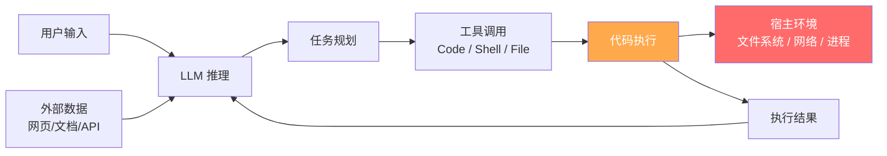
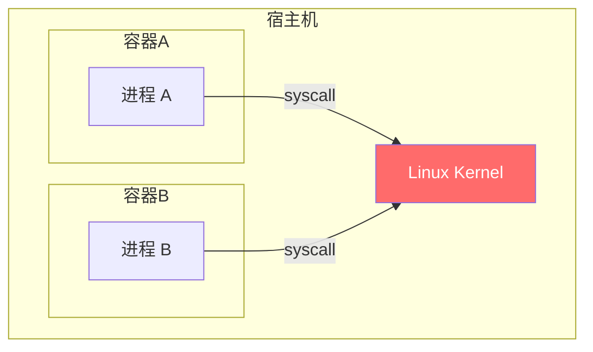
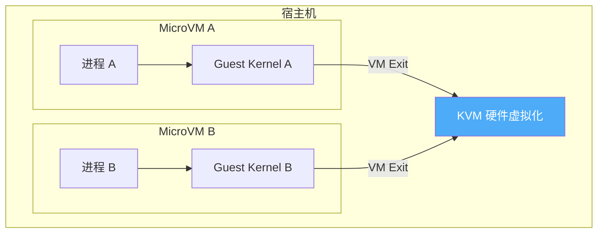
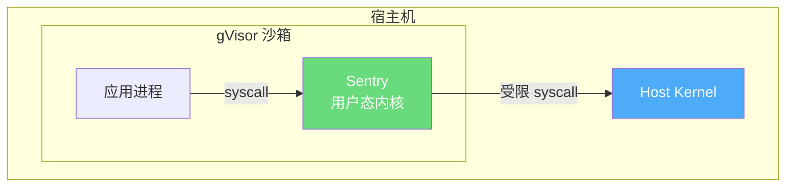
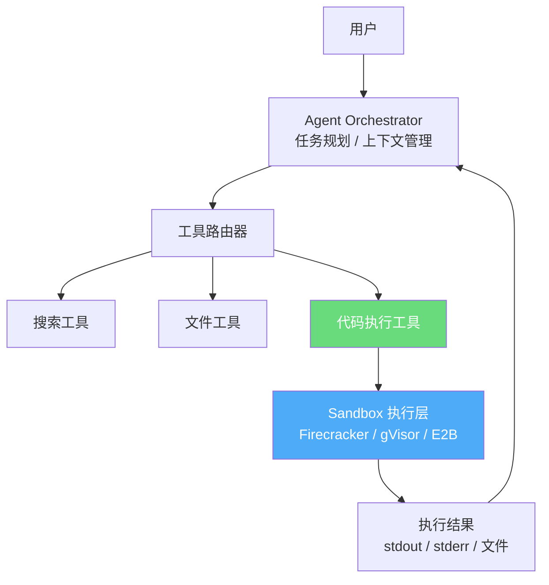
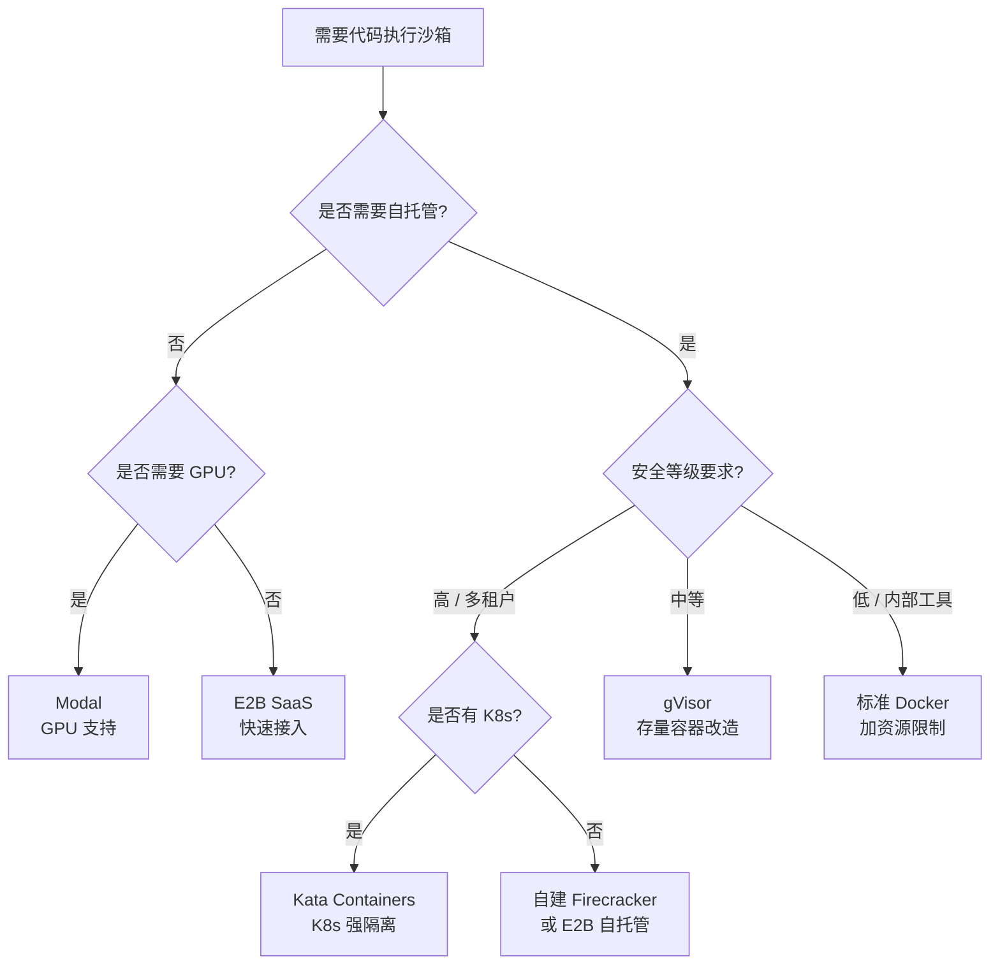

## 引言

当 AI Agent 还只是一个问答系统时，安全问题相对简单：无非是输出过滤、内容审核。但随着 Agent 获得了执行代码、调用工具、读写文件系统、访问网络的能力，整个风险模型发生了质变。

问题不在于 LLM 本身不安全，而在于 Agent 所执行的代码来源无法完全受控。LLM 生成的代码、用户传入的脚本、从外部网页抓取的内容——任何一环都可能携带恶意指令。没有隔离边界，一次成功的 prompt injection 就足以让 Agent 成为攻击者的工具：删除数据、外传凭证、横向渗透到其他服务。

Sandbox（沙箱）是解决这个问题的核心机制。它在 Agent 的执行路径上建立一道硬边界，让代码在受控的隔离环境中运行，无论执行什么，都无法突破边界影响宿主系统。

本文从威胁模型出发，系统梳理沙箱的四类隔离机制，对比当前主流的开源与商业方案，并给出在 Agent 工程中集成沙箱的实践建议。

---

## Agent 的执行风险：威胁模型

### 典型执行路径

一个具备代码执行能力的 Agent，其执行链大致如下：



攻击者的目标是控制 `EXEC` 节点的行为，而注入点可以出现在链条的多个位置：

- **用户输入层**：直接在对话中嵌入恶意指令（经典 prompt injection）
- **外部数据层**：在 Agent 抓取的网页或文档中藏入指令（indirect prompt injection）
- **工具调用层**：滥用合法工具权限（如通过 `curl` 外传数据）

### 主要风险类别

| 风险 | 描述 | 示例 |
|------|------|------|
| **数据泄露** | 读取敏感文件并外传 | 读取 `~/.ssh/id_rsa`，POST 到攻击者服务器 |
| **主机逃逸** | 突破容器/进程边界，访问宿主系统 | 利用内核漏洞获取宿主 root 权限 |
| **横向移动** | 利用 Agent 的网络权限访问内网服务 | 向内网数据库发送请求 |
| **资源滥用** | 占用大量 CPU/内存/磁盘 | 无限循环、fork bomb、磁盘写满 |
| **持久化后门** | 写入 cron、修改启动项 | 植入反弹 shell 脚本 |

沙箱的价值在于：即使 LLM 被欺骗、生成了恶意代码，执行也被限制在隔离环境中，无法真正造成伤害。

---

## 沙箱隔离机制：四种技术路径

不同的隔离机制在安全强度、性能开销和兼容性上各有取舍。理解它们的原理，是选型的基础。

### 容器隔离（cgroups + namespaces）

Linux 容器通过两个核心机制实现隔离：

- **Namespaces**：隔离进程视图。包括 PID（进程树）、net（网络栈）、mnt（文件系统挂载）、user（用户 ID）、uts（主机名）等命名空间。容器内的进程只能看到自己命名空间内的资源。
- **cgroups**：限制资源使用上限。CPU、内存、磁盘 I/O、网络带宽均可约束。

**关键限制**：容器与宿主共享同一个 Linux 内核。这意味着如果内核存在漏洞（如 CVE-2022-0185 等容器逃逸漏洞），攻击者仍有可能突破隔离。



容器隔离的攻击面集中在 **共享内核的 syscall 接口**。

**适用场景**：开发环境、低安全等级的代码执行、受信任的代码来源。

### MicroVM（Firecracker / QEMU）

MicroVM 给每个执行环境分配独立的内核实例，依赖硬件虚拟化（KVM）实现强隔离。

**Firecracker** 是 AWS 为 Lambda/Fargate 开发的 microVM，核心设计目标是极简化：

- 启动时间约 125ms（官方数据）
- 每个 VM 内存开销约 5MB
- 设备模型极简（仅 virtio 网络和块设备），攻击面小
- 已在 AWS 大规模生产部署（数百万并发 VM）



每个 VM 有独立内核，容器逃逸漏洞对 microVM 无效。代价是更高的资源开销和额外的启动延迟。

**适用场景**：生产级 Agent 代码执行、多租户场景、高安全要求。

### 内核拦截（gVisor）

gVisor 是 Google 开源的沙箱运行时，核心思路是在用户态实现一个 Linux 内核的子集（称为 **Sentry**），拦截容器内的 syscall，不让它们直接触达宿主内核。

- Sentry 实现了约 200 个 Linux syscall
- 容器的 syscall 先到 Sentry，Sentry 再用少数几个受控 syscall 与宿主交互
- 兼容 OCI 容器接口（`runsc` 作为 containerd 的 runtime）



**缺陷**：
- 约 20% 的 syscall 未实现，部分应用（特别是依赖特殊内核特性的）无法运行
- syscall 拦截带来额外延迟，I/O 密集型负载性能损耗明显
- 不如 microVM 的隔离彻底（Sentry 本身如果有漏洞，仍可能被利用）

**适用场景**：已有容器化应用、需要比标准容器更强安全性但不想引入 VM 开销的场景。

### WebAssembly（WASM）

WASM 是一种可移植的字节码格式，其运行时（如 Wasmtime、WasmEdge）自带沙箱：

- 所有内存访问限制在线性内存段内，无法访问外部指针
- 无法直接调用系统 API，必须通过 WASI（WebAssembly System Interface）白名单授权
- 启动极快（微秒级），跨平台

**主要局限**：语言生态有限。Python 的 WASM 支持仍不成熟，限制了其在 AI Agent 中的主流应用，更多用于插件系统、浏览器端执行或边缘计算场景。

### 四种机制横向对比

| 维度 | 容器 | MicroVM | gVisor | WASM |
|------|------|---------|--------|------|
| **隔离强度** | 弱（共享内核） | 强（独立内核） | 中（用户态内核） | 强（内存沙箱） |
| **冷启动延迟** | <500ms | ~125ms（Firecracker） | <1s | <10ms |
| **内存开销** | 极低 | 低（~5MB/VM） | 低 | 极低 |
| **语言支持** | 全语言 | 全语言 | 全语言（部分 syscall 缺失） | Rust/C/Go 为主 |
| **OCI 兼容** | 是 | 通过 Kata | 是（runsc） | 否 |
| **GPU 支持** | 是（需配置） | 有限 | 有限 | 否 |
| **适合 Agent** | 低安全场景 | 生产首选 | 平衡方案 | 插件/边缘场景 |

---

## 主流方案对比

### 开源方案

#### E2B

E2B（Environment to Build）是目前 Agent 生态中专用度最高的开源沙箱方案。

**底层技术**：基于 Firecracker microVM，每个沙箱是一个独立的轻量 VM。

**核心能力**：
- 提供 Python 和 TypeScript SDK，几行代码即可启动沙箱
- 支持文件上传/下载、持久化文件系统（同一会话内状态保留）
- 支持长时运行进程（后台服务、代码服务器）
- 支持自定义模板（基础镜像可自定义）
- 内置网络隔离，出口流量可控

```python
from e2b_code_interpreter import Sandbox

with Sandbox() as sandbox:
    result = sandbox.run_code("import pandas as pd; print(pd.__version__)")
    print(result.text)

    # 上传文件
    with open("data.csv", "rb") as f:
        sandbox.files.write("/home/user/data.csv", f)

    # 执行数据处理
    result = sandbox.run_code("""
import pandas as pd
df = pd.read_csv('/home/user/data.csv')
print(df.describe())
""")
```

**定位**：云端托管服务（有 SaaS，也支持自托管），适合快速接入 Agent 的代码执行能力。

---

#### gVisor（runsc）

Google 开源的 syscall 拦截沙箱，以 OCI runtime 形式集成到 Docker/containerd/Kubernetes。

```bash
# 在 Docker 中使用 gVisor
docker run --runtime=runsc --rm python:3.11 python -c "print('in gVisor sandbox')"

# 在 Kubernetes 中配置 RuntimeClass
apiVersion: node.k8s.io/v1
kind: RuntimeClass
metadata:
  name: gvisor
handler: runsc
```

对已有容器化 Agent 来说，切换到 gVisor 几乎无需改代码，只需修改 runtime 配置。代价是部分 syscall 不支持，需要做兼容性测试。

---

#### Kata Containers

Kata Containers 是 CNCF 项目，将 VM 级别的隔离封装成 OCI 兼容接口。每个容器运行在独立的轻量 VM 中（支持 QEMU、Firecracker、Cloud Hypervisor 作为后端）。

```bash
# Kubernetes RuntimeClass 配置
apiVersion: node.k8s.io/v1
kind: RuntimeClass
metadata:
  name: kata
handler: kata-fc  # 使用 Firecracker 后端
```

与 gVisor 相比，Kata 的隔离强度更高（真正的独立内核），syscall 兼容性也更好，但资源开销相对更大。适合对隔离性要求严格、同时需要保留 Kubernetes 调度能力的生产环境。

---

#### Daytona

Daytona 定位是标准化开发环境管理平台，类似 GitHub Codespaces 的开源替代。支持 Docker 和 VM 两种后端，可以为 Agent 提供一个完整的、预配置好的工作环境（含 Git 仓库、开发工具链、语言环境）。

适合需要 Agent 在完整开发环境中操作（代码编写、测试、提交）的场景，而非轻量代码执行。

---

#### 自建 Firecracker

对于有基础设施团队、需要完全控制的场景，可以直接基于 Firecracker 自建执行平台：

```bash
# Firecracker 启动一个 microVM 的基本流程
# 1. 启动 API server
./firecracker --api-sock /tmp/firecracker.socket

# 2. 配置 VM（内核、磁盘镜像、网络）
curl -X PUT --unix-socket /tmp/firecracker.socket \
  http://localhost/boot-source \
  -H 'Content-Type: application/json' \
  -d '{"kernel_image_path": "/path/to/vmlinux", "boot_args": "console=ttyS0 reboot=k panic=1"}'

# 3. 启动 VM
curl -X PUT --unix-socket /tmp/firecracker.socket \
  http://localhost/actions \
  -H 'Content-Type: application/json' \
  -d '{"action_type": "InstanceStart"}'
```

这条路需要自行处理 VM 生命周期管理、镜像构建、网络配置、快照恢复等工程细节，但能获得最大灵活性和成本控制。

---

### 商业/闭源方案

#### OpenAI Code Interpreter

ChatGPT 内置的代码执行环境。用户可上传文件，GPT-4o 在沙箱中执行 Python 代码进行数据分析、图表生成、文件处理。

- 隔离强度：高（OpenAI 未公开技术细节，但设计上是强隔离）
- 语言：Python（内置丰富数据科学库）
- 限制：仅限 OpenAI 平台，不可自托管，无法用于自建 Agent

#### Modal

Modal 提供函数级别的云端执行环境，按调用计费。Agent 可以通过 Python SDK 将任意函数部署到 Modal，在隔离的容器环境中执行，支持 GPU。

```python
import modal

app = modal.App("agent-executor")

@app.function(
    image=modal.Image.debian_slim().pip_install("pandas", "numpy"),
    timeout=60,
)
def execute_analysis(code: str) -> str:
    import io, contextlib
    buf = io.StringIO()
    with contextlib.redirect_stdout(buf):
        exec(code, {})
    return buf.getvalue()

# 在 Agent 中调用
result = execute_analysis.remote(user_code)
```

适合需要 GPU 计算、或希望执行环境弹性伸缩的场景。缺点是无法本地部署，有数据出境合规风险。

#### Morph Cloud

Morph 提供基于 microVM 的云执行环境，强调快照/恢复能力：可以将 VM 状态快照，在不同请求间复用（避免每次冷启动），也支持并行 fork（从同一个快照派生多个执行实例）。

这种 snapshot-and-restore 机制对 Agent 特别有价值：预热好环境后快照，后续每次执行都从快照恢复，启动时间从秒级降到毫秒级。

#### Anthropic Claude Artifacts

Anthropic 在 Claude 平台提供的 Artifacts 运行环境，用于执行 Claude 生成的 React/HTML 代码片段，在浏览器隔离的 iframe 中运行。定位是前端代码预览，不是通用代码执行沙箱。

---

### 方案总览

| 方案 | 类型 | 隔离机制 | 自托管 | GPU | 快照 | 适用场景 |
|------|------|----------|--------|-----|------|----------|
| **E2B** | 开源+SaaS | Firecracker | 支持 | 否 | 否 | Agent 代码执行首选 |
| **gVisor** | 开源 | syscall 拦截 | 是 | 否 | 否 | 存量容器增强隔离 |
| **Kata Containers** | 开源 | VM（OCI 兼容） | 是 | 有限 | 否 | K8s 强隔离容器 |
| **Daytona** | 开源 | 容器/VM | 是 | 否 | 否 | Agent 开发环境 |
| **自建 Firecracker** | 开源 | microVM | 是 | 否 | 支持 | 完全自控的生产平台 |
| **Code Interpreter** | 闭源 | 未公开 | 否 | 否 | — | OpenAI 平台内使用 |
| **Modal** | 商业 | 容器 | 否 | 支持 | 否 | GPU 计算、弹性执行 |
| **Morph Cloud** | 商业 | microVM | 否 | 否 | 支持 | 快速恢复、并行 fork |

---

## 在 Agent 中集成 Sandbox 的架构模式

### 架构位置

沙箱在 Agent 架构中处于工具执行层，是 Agent 调用"代码执行"工具时的底层基础设施：



### 三种集成模式

**模式一：SDK 直接调用（E2B 模式）**

Agent 进程通过 SDK 管理沙箱生命周期，简单直接：

```python
class CodeExecutionTool:
    def __init__(self):
        self.sandbox = None

    def __enter__(self):
        self.sandbox = Sandbox()  # 启动 microVM
        return self

    def __exit__(self, *args):
        self.sandbox.kill()

    def execute(self, code: str) -> dict:
        result = self.sandbox.run_code(code)
        return {
            "stdout": result.text,
            "error": result.error,
            "artifacts": [f.name for f in result.results if hasattr(f, 'name')]
        }
```

适合单进程 Agent、快速原型。

**模式二：独立沙箱服务（HTTP API）**

将沙箱封装为独立服务，Agent 通过 REST API 调用：

```
POST /execute
{
  "code": "print('hello')",
  "language": "python",
  "timeout": 30,
  "session_id": "abc123"  // 复用同一个沙箱会话
}
```

适合多 Agent 共享执行基础设施、需要独立扩缩容的场景。

**模式三：Kubernetes Job**

每次代码执行创建一个 K8s Job（Pod），执行完自动销毁：

```yaml
apiVersion: batch/v1
kind: Job
metadata:
  name: agent-exec-abc123
spec:
  ttlSecondsAfterFinished: 30
  template:
    spec:
      runtimeClassName: kata  # 使用 Kata Containers
      restartPolicy: Never
      containers:
        - name: executor
          image: python:3.11-slim
          command: ["python", "-c", "$(CODE)"]
          resources:
            limits:
              cpu: "1"
              memory: "512Mi"
```

适合大规模并发、需要 Kubernetes 调度能力的生产环境。

### 关键工程考量

**文件系统策略**

- 宿主文件系统只读挂载，沙箱内用临时可写层（overlayfs）
- 沙箱销毁后临时层自动清除，防止数据残留
- 需要持久化的文件（如分析结果）通过明确的 API 接口导出

**网络控制**

- 默认禁止所有出口流量
- 仅通过 allowlist 放行必要的外部依赖（如 PyPI 镜像）
- 禁止访问内网 IP 段（防止横向移动）

**执行限制**

```python
SANDBOX_LIMITS = {
    "timeout_seconds": 30,       # 执行超时
    "max_memory_mb": 512,        # 内存上限
    "max_cpu_percent": 100,      # CPU 上限（单核）
    "max_output_bytes": 1 << 20, # 输出大小限制（1MB）
    "max_file_size_mb": 100,     # 单文件大小限制
}
```

**会话复用与 Snapshot**

对于多轮对话 Agent，同一会话可复用同一个沙箱（保留安装的包、中间变量）。但要注意：

- 长期复用会导致状态污染（前一步的副作用影响后续执行）
- 可用快照机制：在会话开始后快照，每轮执行后可选择恢复到快照（隔离）或保留状态（连续）

---

## 选型建议

### 决策框架



### 关键指标对比

| 指标 | 容器 | gVisor | Kata/Firecracker | E2B |
|------|------|--------|------------------|-----|
| **冷启动** | <500ms | <1s | 100-300ms | ~1-2s（含网络） |
| **隔离强度** | ★★☆ | ★★★ | ★★★★ | ★★★★ |
| **运维复杂度** | 低 | 中 | 高 | 低（托管） |
| **并发成本** | 极低 | 低 | 低-中 | 按量计费 |
| **持久化** | 需配置 | 需配置 | 支持快照 | 支持 session |
| **GPU 支持** | 支持 | 有限 | 有限 | 否 |

**推荐起点**：

- **个人项目 / 快速原型**：E2B SaaS，10 分钟接入，无需运维
- **有 K8s 的团队**：Kata Containers（高安全）或 gVisor（中等安全，低改造成本）
- **完全自控 / 大规模**：自建 Firecracker 平台，参考 E2B 的开源实现
- **需要 GPU**：Modal（托管）或自建 GPU 容器环境（加 gVisor）

---

## 常见误区与陷阱

### 误区一：Docker 容器够用了

很多团队的第一反应是"用 Docker 跑就行"。这在低威胁场景下可以接受，但需要清醒认识其局限：容器共享宿主内核，历史上有数个 CVE 可以实现容器逃逸（`runc` 的多个漏洞、`overlayfs` 权限提升等）。对于执行不可信代码的场景，共享内核是结构性风险，不是补丁能完全弥补的。

### 误区二：设了超时就安全了

超时确实能防止无限占用资源，但不能防止**超时前已完成的恶意操作**。30 秒足够完成一次 `curl` 数据外传、一次内网扫描、或者写入一个定时任务。超时是资源保护，不是安全控制。

### 误区三：禁掉网络就万事大吉

禁网能防止数据外传和网络横向移动，但攻击面不止网络：

- 写满磁盘导致 DoS
- 消耗所有 CPU 影响宿主性能（cgroups 需要配置）
- 在共享目录写入恶意文件，影响其他任务读取

沙箱的安全需要网络、文件系统、进程、资源四个维度同时设防。

### 误区四：沙箱粒度太粗

将一个长期 session 的所有代码都跑在同一个沙箱里，会导致状态积累：安装了不该有的包、设置了影响后续执行的环境变量、产生了大量临时文件。沙箱粒度要根据业务语义设计：

- 单次代码块执行 → 每次新建沙箱（最干净）
- 多轮数据分析 session → session 级复用（可接受，做好清理）
- 跨用户共享 → 绝对隔离，不允许复用

### 误区五：忽视冷启动对用户体验的影响

一个需要 2 秒启动的沙箱，在交互式 Agent 中会显著影响体验。解决方案：

- **预热池**：提前启动一批待用沙箱，请求到来时直接分配
- **Snapshot/Restore**：启动一次后快照，后续从快照恢复（Firecracker 的 snapshot 恢复可以达到 <100ms）
- **复用**：合理的 session 级复用，减少不必要的冷启动

---

## 结论

Sandbox 不是 Agent 的可选优化，而是生产化的基础设施前提。没有隔离边界的代码执行能力，本质上是在给 Agent 交一把无限权限的钥匙——而 LLM 是可以被欺骗的。

从工程角度看，沙箱选型的核心矛盾是**安全隔离强度与执行延迟/运营成本的平衡**：

- 容器隔离成本最低，但安全边界最弱
- microVM（Firecracker）在强隔离和低开销之间取得了最好的平衡，是当前生产场景的主流选择
- gVisor 提供了容器兼容接口下的增强安全，适合改造成本敏感的场景

对于大多数团队，**E2B 是最快的正确起点**：几行代码接入、基于 Firecracker 的强隔离、有完整的 Agent 集成 SDK。随着规模增长，再逐步迁移到自托管的 Firecracker 或 Kata 平台，获取完整的基础设施控制权。

Agent 的能力边界在扩展，但扩展速度越快，隔离边界就越重要。这不是过度设计，而是工程上的基本自律。
