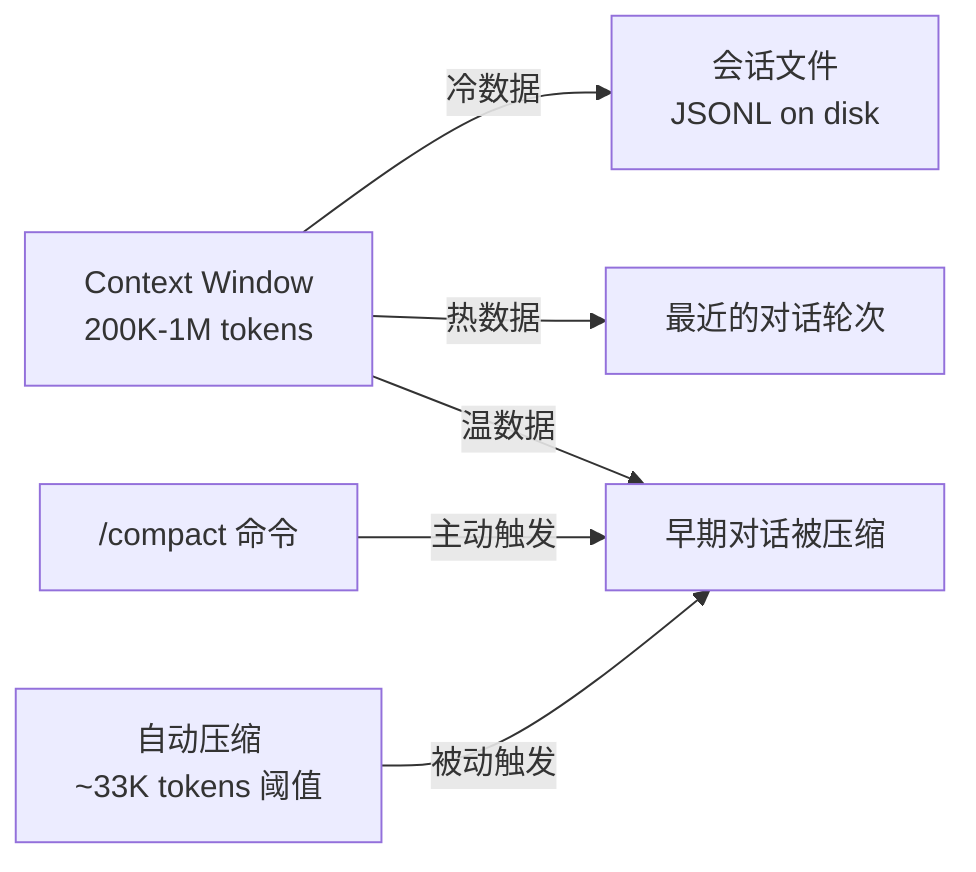
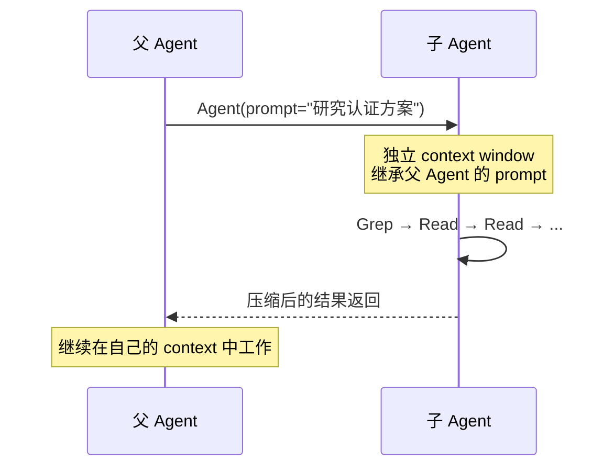
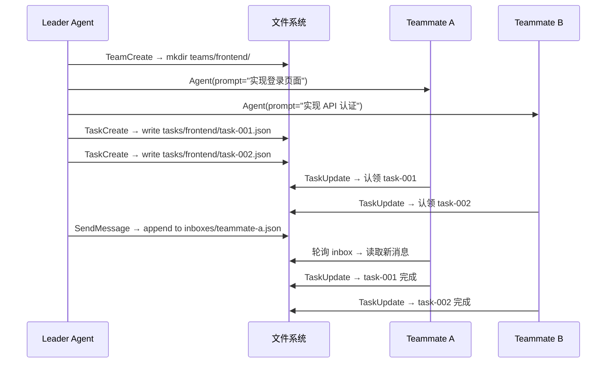

> "UNIX is basically a simple operating system, but you have to be a genius to understand the simplicity."
> — Dennis Ritchie

当我们今天设计 AI Agent 系统时，最优雅的答案不在最新的论文里，而在半个世纪前 Bell Labs 的走廊上。

文件系统存储一切状态，管道连接一切工具，进程模型管理一切并发，shell 提供一切能力——这些 1970 年代的操作系统原语，在 2025 年成了 AI Agent 最自然的骨架。Claude Code 是目前将这套古老智慧运用得最彻底的 AI Agent 产品。它没有发明新的状态管理协议，没有引入消息队列，没有构建自己的数据库。它只是把 Unix 哲学贯彻到了每一个设计决策中。

本文将从 Unix 哲学的源头出发，逐层展开 Claude Code 的实现机制，展示操作系统原语如何成为一个现代 AI Agent 的完整基础设施。

## Unix 哲学：操作系统设计的艺术

要理解 Claude Code 的设计，先要理解它站在谁的肩膀上。

### 三条黄金法则

1978 年，Doug McIlroy 在 Bell System Technical Journal 上写下了 Unix 哲学的三条核心法则：

1. **Write programs that do one thing and do it well.**
2. **Write programs to work together.**
3. **Write programs to handle text streams, because that is a universal interface.**

这三条法则看似朴素，却蕴含着深刻的工程智慧。

第一条是关于**边界**。一个程序只做一件事，意味着它的行为可预测、可测试、可替换。`grep` 只搜索，`sort` 只排序，`wc` 只计数。每个工具都是一个可信赖的黑盒。当 AI Agent 需要调用工具时，这种可预测性至关重要——Agent 必须准确理解每个工具能做什么、不能做什么。

第二条是关于**组合**。单独的 `grep` 没有太大价值，但 `grep | sort | uniq -c | sort -rn` 就能在几秒内完成一次全文分析。程序之间的协作不是通过共享内存或复杂的 API 调用，而是通过最简单的数据流。当 Agent 串联多个工具完成复杂任务时，遵循的正是同样的组合逻辑。

第三条是关于**接口**。文本流作为通用接口，让任意两个程序无需提前约定就能协作。写于 1980 年的 `sort` 可以毫无修改地处理 2025 年写的程序输出。这种时间跨度上的兼容性，源自接口的极致简单。当 Claude Code 选择 JSON-RPC over stdio 作为工具协议时，延续的正是这个传统。

### 管道：最伟大的发明之一

1964 年，Douglas McIlroy 在 Bell Labs 写下了一份内部备忘录：

> "We should have some ways of coupling programs like garden hose — screw in another segment when it becomes necessary to massage data in another way."

这个"花园水管"的比喻，要等将近十年才变成现实。

1973 年 1 月 15 日，Ken Thompson 用一个晚上实现了 `pipe()` 系统调用。更关键的是，他当晚还改写了几乎所有 Unix 工具，让它们支持从 stdin 读取输入。第二天清晨，Bell Labs 爆发了一场 "one-liner 狂欢"——研究员们发现，原本需要写程序才能完成的任务，现在用一行管道命令就够了。

管道的技术本质是四个系统调用的精确编排：

```
pipe()  →  创建匿名管道（一对文件描述符）
fork()  →  创建子进程
dup2()  →  重定向文件描述符（stdout → 管道写端，stdin → 管道读端）
exec()  →  替换为目标程序
```

但管道的深层意义远超技术实现。它确立了一个原则：**stdin/stdout 是程序之间的标准接口契约**。任何程序只要遵循这个契约——从 stdin 读、向 stdout 写——就能与其他任何程序组合。程序之间不需要知道彼此的存在，不需要链接对方的库，不需要约定数据格式。这是零耦合的组合。

### 一切皆文件：最深刻的抽象

Unix 最有影响力的设计决策，是将"文件"这个概念从磁盘上的数据块扩展为一切 I/O 资源的统一抽象。

动机很实际。正如 Ken Thompson 所解释的：

> "We have such a large set of utilities for operating on [the file interface], that anything you can jam into it gets all those utilities for free."

这意味着：文档、目录、硬盘、终端、键盘、打印机、网络连接——全部通过同一组系统调用访问：`open()`、`read()`、`write()`、`close()`。

这个抽象在后来的发展中被推向极致：

- **/dev 设备文件**：物理设备在文件系统中有对应的路径。`/dev/sda` 是硬盘，`/dev/tty` 是终端，`/dev/null` 是黑洞。你可以用 `cat` 读取硬盘原始数据，用 `echo` 向终端写入字符。
- **/proc 文件系统**：1984 年，Tom Killian 在 USENIX 发表了 "Processes as Files"。他的洞察是：进程信息也可以通过文件接口暴露。`/proc/1234/status` 显示进程状态，`/proc/1234/fd/` 列出打开的文件描述符。用 `read()` / `write()` 替代 `ptrace()` 系统调用，大幅简化了调试工具的实现。
- **Plan 9 的延伸**：Bell Labs 的后续项目 Plan 9 将"一切皆文件"推到了逻辑极限——网络栈是文件（`/net/tcp`），窗口系统是文件（`/dev/draw`），甚至每个进程都有自己的命名空间视图。这个概念后来成为 Linux namespace 和 Docker 容器隔离的理论基础。

### 文件系统层级作为全局命名空间

Unix 文件系统不只是存储方案，它是整个系统中一切资源的**寻址方案**：

| 路径 | 语义 | 内容特征 |
|---|---|---|
| `/etc` | 系统配置 | 静态、文本、管理员维护 |
| `/var` | 变量数据 | 日志、邮件、运行时状态 |
| `/tmp` | 临时文件 | 重启即清、任何人可写 |
| `/proc` | 进程信息 | 动态生成、内核暴露 |
| `/dev` | 设备映射 | 物理和虚拟设备的文件表示 |
| `/home` | 用户数据 | 每个用户独立命名空间 |

这套层级结构的设计哲学是：**位置即含义**。一个文件放在 `/etc` 还是 `/var`，本身就传递了关于它的生命周期、可变性、权限模型的信息。不需要元数据数据库，不需要注册中心——路径就是全部。

### Unix 进程模型

Unix 的进程模型建立在两个优雅的系统调用上：

- **fork()**：复制当前进程。父子进程共享代码，独立运行。关键细节：子进程继承父进程的所有文件描述符——这意味着管道、网络连接、打开的文件都自动传递。
- **exec()**：将当前进程的代码替换为另一个程序。进程 ID 不变，文件描述符不变，只是运行的程序换了。

fork + exec 的组合让进程创建变得极其灵活：先 fork，在子进程中做任意准备工作（重定向 I/O、设置环境变量、修改权限），然后 exec 目标程序。

围绕进程模型，Unix 还建立了一套完整的控制机制：

- **Job control**：`fg`/`bg`/`&`/`Ctrl+Z` 管理前台和后台任务
- **Exit codes**：最简单的进程间通信协议——`0` 表示成功，非零表示失败。整个 shell 脚本的控制流（`&&`、`||`、`if`）建立在这个一字节的信号上
- **Signals**：软件中断机制。`SIGTERM` 请求终止，`SIGKILL` 强制杀死，`SIGINT` 中断前台进程，`SIGSTOP`/`SIGCONT` 暂停和恢复

### Unix IPC 机制全景

进程之间如何通信？Unix 提供了从简单到复杂的完整工具箱：

- **匿名管道**：`pipe()` 创建，父子进程间的单向数据流。生命周期与进程绑定。
- **命名管道（FIFO）**：`mkfifo` 创建，在文件系统中有路径名。不相关的进程也能通信。
- **Unix domain socket**：比 IP socket 更轻量的本地通信。支持双向数据流和文件描述符传递。
- **文件锁**：`flock()` / `fcntl()` 实现的最简单互斥机制。Advisory lock 靠协商，mandatory lock 靠内核强制。
- **共享内存 / mmap**：最高性能的进程间数据共享。`mmap()` 将文件映射到内存地址空间，多个进程可以直接读写同一块物理内存。

---

这些 50 年前的设计原则——单一职责、管道组合、文件接口、进程隔离——恰好是 LLM Agent 最自然的工具使用方式。接下来看 Claude Code 如何将每一条都运用到了极致。

## 一切皆文件：Claude Code 的文件系统宇宙

Claude Code 中几乎所有状态、配置、通信、记忆都以文件形式存在。`.claude/` 目录就是 Agent 的"根文件系统"。

### .claude/ 目录全景

```
~/.claude/
├── CLAUDE.md                 # 全局指令（≈ /etc/profile）
├── settings.json             # 用户偏好（≈ /etc/sysctl.conf）
├── settings.local.json       # 本机覆盖（≈ /etc/hosts.local）
├── commands/                 # 全局斜杠命令（≈ /usr/local/bin/）
├── skills/                   # 技能定义（≈ 带 .desktop 元数据的可执行文件）
├── agents/                   # 子 Agent 定义（≈ systemd .service 文件）
├── plugins/                  # 插件目录（≈ /usr/lib/modules/）
├── rules/                    # 分文件规则（≈ /etc/conf.d/）
├── projects/                 # 项目记忆与会话（≈ /var/lib/）
│   └── {project-path-hash}/
│       ├── memory/
│       │   ├── MEMORY.md     # 记忆索引
│       │   └── *.md          # 主题记忆文件
│       └── *.jsonl           # 会话历史
├── plans/                    # 计划文件（≈ /tmp/ 工作草稿）
├── tasks/                    # 任务管理（≈ /var/spool/）
│   └── {team}/
│       ├── task-*.json
│       └── .locks/
├── teams/                    # 团队协调（≈ /var/mail/）
│   └── {team}/
│       ├── config.json
│       └── inboxes/*.json
├── file-history/             # 文件修改快照
├── shell-snapshots/          # Shell 环境快照
├── history.jsonl             # 全局命令历史
└── debug/                    # 调试信息
```

每一类数据都有对应的 Unix 目录类比。这不是巧合，而是设计选择：Claude Code 的架构师们有意识地复用了操作系统级别的组织模式。

### 配置即文件：CLAUDE.md 的层级加载

CLAUDE.md 是 Claude Code 的核心配置机制。它的加载方式直接复刻了 Unix shell 的配置层级：

```
Unix:          /etc/profile → ~/.profile → ~/.bashrc → source 其他文件
Claude Code:   ~/.claude/CLAUDE.md → ./CLAUDE.md → ./subdir/CLAUDE.md → .claude/rules/*.md
```

优先级规则也一样：**最近的配置文件胜出**。子目录的 CLAUDE.md 覆盖项目根的，项目根的覆盖全局的。这和 `.gitignore`、`.editorconfig` 的就近生效规则完全一致。

`rules/` 目录是 CLAUDE.md 的模块化拆分。当一个项目的 CLAUDE.md 膨胀到几百行时，可以按主题拆分成独立的 `.md` 文件放入 `.claude/rules/` 目录。所有文件在启动时自动加载，与 CLAUDE.md 同等优先级。这和 `/etc/conf.d/` 的分文件配置模式完全对应——当 `/etc/sysctl.conf` 太长时，拆成 `/etc/sysctl.d/*.conf`。

`settings.json` 也采用三层级联：

```
~/.claude/settings.json        → 全局设置
.claude/settings.json          → 项目设置
.claude/settings.local.json    → 本机覆盖（不提交到 git）
```

权限模型采用 **deny-wins** 策略：如果任何层级禁止了某个工具，上层的允许无法覆盖。这类似 Unix 文件权限中"执行位缺失则无法执行"的强制性。

### 记忆即文件

Claude Code 的记忆系统完全建立在文件之上：

```
~/.claude/projects/{encoded-cwd}/memory/
├── MEMORY.md           # 索引文件，启动时加载（200 行截断）
├── user_role.md        # 用户角色记忆
├── feedback_testing.md # 测试偏好记忆
├── project_auth.md     # 项目上下文记忆
└── ...
```

每个记忆文件都是纯 Markdown，带有 YAML frontmatter 描述元数据（name、description、type）。`MEMORY.md` 作为索引，只包含指向各记忆文件的链接和简短描述。

这个设计的好处是透明和可操作的：

- 想查看 Agent 记住了什么？`cat memory/*.md`
- 想搜索特定记忆？`grep -r "部署" memory/`
- 想手动修正？直接编辑 `.md` 文件
- 想备份？`cp -r memory/ memory-backup/`

Auto Dream 功能会在会话结束后自动整理记忆：修剪过期信息、解决矛盾条目、更新索引。但所有操作的输入和输出都是文件——没有隐藏的数据库，没有不透明的向量存储。

类比 Unix：`/var/lib/` 目录存放应用的持久化数据。每个应用有自己的子目录，数据格式由应用决定，但文件系统提供统一的访问和管理接口。

### 会话即文件

每次与 Claude Code 的对话都记录在 JSONL 文件中：

```
~/.claude/projects/{encoded-cwd}/{session-id}.jsonl
```

JSONL（JSON Lines）格式的选择很讲究：每行一个 JSON 对象，支持流式追加（`>>` 操作）而不需要维护文件结构完整性。即使写入中断，已有的行仍然有效。这和 Unix 日志写入 `/var/log/` 的方式如出一辙——`syslog` 也是逐行追加。

`history.jsonl` 作为全局历史索引，记录所有会话的元数据。会话恢复要求当前工作目录（CWD）与创建时完全匹配——路径被编码为目录名，确保项目上下文不会混淆。

类比：Unix 的 `wtmp`/`utmp` 文件记录用户登录历史和活跃会话，`/var/log/` 存储系统日志。

### 通信即文件：Agent Teams 的邮箱系统

当多个 Agent 需要协作时，Claude Code 选择了最 Unix 的方案：用文件系统实现消息传递。

```
~/.claude/teams/{team}/inboxes/{agent-name}.json
```

每个 Agent 有自己的 inbox 文件，格式是 append-only 的 NDJSON（Newline Delimited JSON）。发送消息就是向目标 Agent 的 inbox 文件追加一行 JSON。接收消息就是读取自己的 inbox 文件。

没有后台守护进程，没有消息队列服务，没有 pub/sub 系统。文件系统是唯一的协调基底。Agent 在每个 agentic loop 迭代之间轮询自己的 inbox 文件，检查是否有新消息。

这直接复刻了 Unix 的 `/var/mail/` 邮箱系统：每个用户一个文件，`sendmail` 追加邮件，用户的邮件客户端定期检查。简单、透明、几乎不可能崩溃。

### 任务即文件

Agent Teams 的任务管理同样基于文件：

```
~/.claude/tasks/{team}/
├── task-abc123.json      # 任务定义（subject、status、owner、blockedBy、blocks）
├── task-def456.json
└── .locks/               # 并发控制
    └── task-abc123.lock
```

每个任务是一个独立的 JSON 文件，包含主题、状态、所有者、依赖关系等字段。`.locks/` 目录下的锁文件提供基本的并发互斥。

类比 Unix 的 `/var/spool/`：打印队列、邮件队列、cron 作业都以文件形式存储在 spool 目录中，每个作业一个文件，调度器轮询目录检查新作业。

### 计划即文件

当 Claude Code 进入 Plan Mode 时，分析和策略被写入一个 Markdown 文件：

```
~/.claude/plans/{plan-name}.md
```

Agent 在计划阶段将思路写入此文件，人类可以直接查看和编辑（`Ctrl+G` 在编辑器中打开）。退出 plan mode 后，Agent 读取这个文件来执行。

这是一个声明式的工作流：先描述"要做什么"，再执行。和 `Makefile` 的哲学一脉相承——build plan 是文本文件，人类可读可编辑，工具按计划执行。

### 文件历史与快照

Claude Code 通过文件快照实现撤销能力：

- `.claude/file-history/` 记录每次文件修改前后的快照
- `shell-snapshots/` 保存 Shell 环境状态（CWD、环境变量）
- 按 `Esc` 可以回退到之前的快照点

这类似文件系统层面的 snapshot/checkpoint 机制（ZFS snapshot、LVM snapshot），但实现在应用层——每次修改前保存原始内容，需要时恢复。

## 管道的精神：标准接口与工具组合

### 每个工具只做一件事

Claude Code 的内置工具严格遵循单一职责原则，每个工具都是对应 Unix 命令的 "LLM-native" 重新封装：

| Claude Code 工具 | Unix 对应 | 职责 | 为 LLM 做的适配 |
|---|---|---|---|
| `Grep` | `grep` / `rg` | 搜索文件内容 | 三种输出模式（content / files_with_matches / count），节省 token |
| `Glob` | `find` / `ls` | 按模式查找文件 | 按修改时间排序，返回结构化路径列表 |
| `Read` | `cat` / `head` / `tail` | 读取文件内容 | 带行号输出，支持 PDF、图片、Jupyter Notebook |
| `Edit` | `sed` / `patch` | 修改文件 | 字符串匹配替换（非行号），唯一性检查防误编辑 |
| `Write` | `echo >` / `cat <<EOF` | 创建或覆盖文件 | 完整文件写入，自动检查是否读过原文件 |
| `Bash` | `sh` / `bash` | 执行 shell 命令 | OS 级沙箱隔离，超时控制 |

为什么要重新封装而不是直接让 Agent 执行 `grep`、`cat`、`sed`？原因有四：

1. **输出格式优化**：`Read` 的带行号输出让 Agent 能精确引用代码位置；`Grep` 的三种输出模式让 Agent 按需选择信息粒度，避免浪费 context token。
2. **安全边界**：每个工具都有独立的权限控制。`Bash` 运行在沙箱中，`Edit` 要求先 `Read` 才能编辑，`Write` 检查是否意外覆盖。
3. **错误容忍**：`Edit` 的唯一性检查确保替换目标在文件中只出现一次——如果匹配到多处，操作失败而不是替换错误的位置。这在 `sed` 中无法保证。
4. **上下文效率**：Agent 的 context window 是有限资源。`Grep` 的 `files_with_matches` 模式只返回文件路径列表（几十 token），而 `content` 模式返回匹配行（可能几千 token）。Agent 可以先用轻量模式定位，再用精确模式深入。

### 工具组合 = LLM 版的管道

在 Unix 中，一个典型的工作流可能是：

```bash
find . -name "*.go" | xargs grep "TODO" | sort | uniq -c | sort -rn
```

Claude Code 的 Agent 在执行任务时，做的是完全类似的事情：

```
Glob("**/*.go")  →  Grep("TODO", files)  →  Read(top_file)  →  Edit(fix)  →  Bash("go test")
```

上一个工具的输出成为下一个工具的上下文输入。这不是通过显式的管道实现的——LLM 的 context window 本身就是管道。每个工具的输出进入 context，Agent 在此基础上决定下一步调用什么工具。

并行工具调用进一步提升了效率：多个独立的 `Grep` 或 `Read` 可以在同一轮中并行执行，类似 `xargs -P` 的并行管道。

### stdin/stdout 作为通用协议

Claude Code 的工具扩展协议 MCP（Model Context Protocol）选择了最 Unix 的通信方式：**JSON-RPC over stdio**。

这意味着：任何语言写的程序，只要能从 stdin 读取 JSON、向 stdout 写入 JSON，就能成为 Claude Code 的工具。不需要 HTTP 服务器，不需要 gRPC 定义，不需要 SDK——stdin/stdout 是通用接口契约。

Claude Code 本身也能成为管道的一环：

```bash
# Claude Code 作为管道中的一个环节
cat error.log | claude -p "分析这些错误日志，总结根因" | tee analysis.md

# 流式 JSON 输出
claude -p "生成测试用例" --output-format stream-json | jq '.result'

# 在脚本中使用
for file in src/*.py; do
  claude -p "review this file for security issues" < "$file" >> review.md
done
```

Headless 模式（`-p` flag）让 Claude Code 成为标准的 Unix 无交互工具：无 TTY 依赖，接受 stdin 输入，输出到 stdout，exit code 报告成功或失败。

### Tool Deferred Loading：动态链接的思想

当一个项目配置了大量 MCP 工具时，所有工具的完整 JSON Schema 定义可能消耗 14-16K tokens 的 context 空间。这是一个严重的资源浪费——大多数会话只会用到其中少数几个工具。

Claude Code 的解决方案直接借鉴了 Unix 动态链接的思想：

```
静态链接（传统方式）：启动时加载所有工具 schema → 14-16K tokens
动态链接（deferred loading）：启动时只加载名称和描述 → ~968 tokens
```

具体机制：

1. MCP 工具在配置中设置 `defer_loading: true`
2. 启动时只有工具名和一行描述被加载到 context
3. 当 Agent 需要使用某个工具时，调用 `ToolSearch`（类比 `dlopen()`）
4. `ToolSearch` 使用 BM25/regex 搜索工具目录，返回匹配工具的完整 schema
5. 完整 schema 被加载到 context，工具可用

类比 Unix：`ld.so` 不会在程序启动时加载所有共享库。它只解析需要的符号，在第一次调用时通过 PLT（Procedure Linkage Table）跳转到动态链接器加载实际的库代码。效果是一样的：按需加载，减少启动开销，节省资源。

实际效果：context 使用减少 85% 以上。

## Bash Tool：给 Agent 一个真正的 Shell

### 为什么需要 Shell

预定义的 API 工具只能做预定义的事。但软件工程的现实是：需求是无限的，场景是不可预测的。

给 Agent 一个 Shell，等于给了它与人类开发者几乎相同的能力边界。`git bisect` 二分定位 bug、`docker compose up` 启动服务、`curl` 调试 API、`awk` 处理日志——这些不是能用几个预定义工具覆盖的。

LLM 在这里有一个天然优势：训练数据中包含大量 shell 交互（Stack Overflow 回答、博客教程、man pages、GitHub Issues）。模型对命令行语法的掌握程度接近甚至超过很多人类开发者。Shell 是 LLM 最流利的"第二语言"。

但直接给 AI Agent shell 访问权限，显然是危险的。Claude Code 的答案是：用操作系统自身的隔离机制来约束 Agent。

### OS 级沙箱：bubblewrap 与 Seatbelt

Claude Code 的 Bash 工具不是直接调用 `/bin/bash`。每条命令都在操作系统级别的沙箱中执行。

**Linux / WSL2**：使用 [bubblewrap](https://github.com/containers/bubblewrap)（bwrap）实现容器级隔离。

```
bwrap \
  --ro-bind / /                    # 根文件系统只读挂载
  --bind $CWD $CWD                 # 当前工作目录可写
  --bind /tmp /tmp                 # /tmp 可写
  --dev /dev                       # 设备文件
  --proc /proc                     # 进程文件系统
  --unshare-net                    # 网络命名空间隔离
  -- bash -c "$COMMAND"
```

关键约束：
- **文件系统隔离**：只有 CWD 及子目录可写，其他路径只读
- **网络隔离**：新的网络命名空间中没有网络接口，所有网络流量必须通过 Unix domain socket 代理（允许 MCP 通信和 API 调用，阻止任意网络访问）
- **进程继承**：子进程继承相同的沙箱约束——Agent 无法通过 `bash -c "bash -c ..."` 逃逸

**macOS**：使用 Apple 的 Seatbelt 框架（`sandbox-exec`），通过声明式 sandbox profile 控制进程能力。网络流量通过 localhost 端口代理。

本质上，Claude Code 是在用 Unix 自身的进程隔离机制来约束运行在 Unix 上的 Agent。容器技术的核心（namespace、cgroups）本来就是为了解决"不可信代码执行"问题而发明的，现在这个"不可信代码"是 AI 生成的。

### 权限控制的分层设计

沙箱解决的是 OS 层面的隔离，但 Agent 层面还需要另一套权限控制：

**三种交互模式**：
- **Normal**：每个工具调用前询问用户确认
- **Auto-Accept**：自动接受沙箱内的操作
- **Plan**：Agent 只能读取和分析，不能修改任何文件

**三级权限列表**：
- **allowlist**：自动放行（如 `Read`、`Grep`）
- **asklist**：每次询问（默认的大多数工具）
- **denylist**：始终阻止

沙箱和权限构成双重防线：沙箱是操作系统层面的硬约束，权限是 Agent 应用层面的软约束。即使权限配置错误，沙箱仍然能防止文件系统和网络的越界访问。

实际效果：沙箱的引入将权限确认提示减少了 84%。这意味着 Agent 可以在绝大多数操作上自主执行，只在真正需要人类判断的操作上暂停——这大幅提升了 Agent 的工作效率。

`dangerouslyDisableSandbox` 这个参数名本身就是设计意图的表达：如果你要关闭安全机制，名字会让你三思。

### Shell 环境持久化

Unix shell 有一个特性：环境变量和当前目录在会话内保持。Claude Code 的 Bash 工具也需要模拟这种行为：

- `shell-snapshots/` 保存每次命令执行后的 shell 环境状态
- `CLAUDE_ENV_FILE` 用于跨 Bash 调用持久化环境变量——Agent 在一次 Bash 调用中 `export FOO=bar`，下一次调用中 `$FOO` 仍然有效
- 工作目录在命令之间保持——Agent 不需要每次都 `cd` 到项目目录

这确保 Agent 的 shell 体验和人类在终端中的体验一致。

## 指令系统：从 rc 文件到 Skill 文件

Claude Code 的指令系统是 Unix 配置和脚本机制在 Agent 世界中的完整映射：

| Claude Code 概念 | Unix 对应物 | 加载时机 | 作用域 |
|---|---|---|---|
| `CLAUDE.md` | `.bashrc` / `.profile` | 启动时 | 全局 / 项目 / 目录 |
| `.claude/rules/*.md` | `/etc/conf.d/*.conf` | 启动时自动加载 | 项目级 |
| `.claude/commands/*.md` | `/usr/local/bin/` 脚本 | 用户调用时 | 全局 / 项目 |
| `.claude/skills/` | 带 `.desktop` 元数据的可执行文件 | 按需 / 自动触发 | 全局 / 项目 |
| `.claude/agents/` | systemd `.service` 文件 | 父 Agent 生成时 | 全局 / 项目 |
| `hooks`（settings.json） | git hooks / systemd hooks | 生命周期事件触发 | 全局 / 项目 |
| `settings.json` | `/etc/sysctl.conf` | 启动时 | 三层级联 |
| `.mcp.json` | systemd `.service` 文件 | 启动时启动服务器 | 项目级 |
| `plugins/` | `/usr/lib/modules/` | 安装时注册 | 全局 |

### CLAUDE.md：Agent 的 .bashrc

就像 `.bashrc` 在每个 shell 会话启动时被 source 一样，CLAUDE.md 在每个 Claude Code 会话启动时被加载到系统提示中。它的内容被 Agent 视为"绝对真理"——在整个会话中无条件遵守。

`/init` 命令实现了类似 systemd 的 init bootstrap：它分析项目中的 `package.json`、`tsconfig.json`、`pyproject.toml`、`Makefile` 等配置文件，自动生成一份项目专属的 CLAUDE.md。就像操作系统启动时的 init 过程——检测硬件、加载驱动、配置网络——`/init` 检测项目技术栈、推断构建命令、识别代码规范，生成一份 Agent 能理解的项目"操作手册"。

### rules/：模块化的配置拆分

当 CLAUDE.md 增长到数百行时，管理变得困难。`.claude/rules/` 目录解决这个问题：

```
.claude/rules/
├── testing.md          # 测试相关规则
├── git-workflow.md     # Git 工作流规范
├── code-style.md       # 代码风格要求
└── security.md         # 安全相关约束
```

所有 `.md` 文件在启动时自动加载，效果等同于写在 CLAUDE.md 中。支持子目录和符号链接。

这正是 `/etc/conf.d/` 的翻版——当 `/etc/sysctl.conf` 变得太长时，管理员把配置拆到 `/etc/sysctl.d/99-custom.conf`、`/etc/sysctl.d/50-network.conf` 中。文件名暗示优先级，目录提供组织结构。

### commands/：文件名即命令名

```
.claude/commands/
├── commit.md           # → 用户输入 /commit 即可调用
├── review.md           # → /review
└── deploy.md           # → /deploy
```

每个 `.md` 文件的文件名（去掉扩展名）就是斜杠命令的名字。文件内容是 Markdown 格式的提示词，支持位置参数（`$1`、`$2`）和全参数捕获（`$ARGUMENTS`）。

纯文本，无需编程，无需注册——创建一个文件就是创建一个命令。和 Unix 中把脚本放到 `/usr/local/bin/` 就能在任何地方调用一样直觉。

### skills/：带元数据的命令进化版

Skills 是 commands 的增强版本，增加了 YAML frontmatter 来描述元数据：

```yaml
---
name: code-review
description: 对代码变更进行安全和质量审查
model: sonnet
tools: [Read, Grep, Glob]
disable-model-invocation: true    # 仅用户手动调用
---

审查当前分支相对于 main 的所有变更...
```

关键设计：
- **渐进式加载**：启动时只加载 `name` 和 `description`（几十 token），实际调用时才加载完整内容。这是工具层面的 deferred loading。
- **两种调用模式**：`disable-model-invocation: true` 表示仅用户手动调用（适用于 `/commit`、`/deploy` 等有副作用的操作）；`user-invocable: false` 表示仅 Claude 自动调用（适用于背景知识型技能）。
- **模型和工具约束**：可以为特定 skill 指定使用的模型和可用工具列表。

类比 Linux 的 `.desktop` 文件：`Name=`、`Exec=`、`Categories=`、`MimeType=` 等元数据描述应用的能力和触发条件，桌面环境根据这些元数据决定何时展示和如何启动应用。

### agents/：可复用的子进程定义

```yaml
---
model: opus
tools: [Read, Write, Edit, Bash, Grep, Glob]
memory_dir: .claude/agents/code-reviewer/memory
---

你是一个专注于代码审查的 Agent。重点关注：
1. 安全漏洞
2. 性能问题
3. 代码风格一致性
```

Agent 定义文件的 YAML frontmatter 指定模型、工具列表、独立记忆目录。Markdown 正文成为该 Agent 的系统提示。

这直接对应 systemd 的 `.service` 文件：

```ini
[Service]
ExecStart=/usr/bin/code-reviewer    # → model + 系统提示
Environment=TOOLS=Read,Write...     # → tools 列表
WorkingDirectory=/var/lib/reviewer  # → memory_dir
```

声明式地描述一个进程（Agent）该如何启动和运行，而不是命令式地编写启动脚本。

### plugins/：模块化扩展包

Plugins 将 commands、agents、skills、hooks、MCP 配置打包成可分发的扩展包：

```
my-plugin/
├── plugin.json         # 清单文件（类比 package.json）
├── commands/           # 斜杠命令
├── agents/             # Agent 定义
├── skills/             # 技能定义
├── hooks/              # 生命周期钩子
├── .mcp.json           # MCP 服务器配置
└── scripts/            # 辅助脚本
```

类比 Linux 内核模块：`insmod` 加载模块，模块在 `/usr/lib/modules/` 中打包分发，`modprobe` 处理依赖关系。Plugin 的安装、注册、按需加载遵循同样的模式。

### Hooks：生命周期钩子系统

Hooks 是 Claude Code 最强大的扩展机制之一。它在 Agent 的整个生命周期中暴露了 21+ 个事件点：

```json
{
  "hooks": {
    "PreToolUse": [
      {
        "type": "command",
        "command": "python3 .claude/hooks/check-dangerous.py"
      }
    ],
    "PostToolUse": [
      {
        "type": "command",
        "command": "prettier --write $CLAUDE_FILE_PATH",
        "matcher": "Write|Edit"
      }
    ]
  }
}
```

**事件类型**包括：`PreToolUse`、`PostToolUse`、`SessionStart`、`SessionEnd`、`PermissionRequest` 等。

**通信协议**完全基于 Unix 标准：
- 通过 **stdin** 接收事件 JSON（包含工具名、参数、上下文）
- 通过 **stdout** 返回结果
- 通过 **stderr** 返回反馈信息（发回给 Claude）
- **Exit code** 控制流程：`0` = 继续执行，`2` = 阻止操作

**四种执行类型**：
- `command`：Shell 命令（最常用）
- `http`：Webhook 调用
- `prompt`：LLM 评估（用另一个 LLM 审查操作）
- `agent`：多轮子 Agent（最强大但最慢）

这比 git hooks 更强大。Git hooks 只有 `pre-commit`、`post-commit` 等少数几个固定事件点。Claude Code 的 hooks 覆盖了**每一次工具调用**的完整生命周期——你可以在 Agent 执行任何操作之前检查、修改或阻止它。

实用场景：
- **自动格式化**：每次 `Write`/`Edit` 后自动运行 `prettier`
- **安全护栏**：在 `Bash` 执行前检查命令是否包含危险操作（`rm -rf`、`DROP TABLE`）
- **上下文注入**：在某些工具调用前注入额外的项目信息
- **外部通知**：操作完成后向 Slack 或其他系统发送通知

## 进程模型：Agent 的生成、隔离与协调

### 主循环：最简单的进程调度

Claude Code 的核心执行模型是一个单线程 while-loop：

```
while true:
    response = model.generate(context)

    if response.has_tool_calls():
        for tool_call in response.tool_calls:
            result = execute_tool(tool_call)
            context.append(result)
    else:
        display(response.text)
        break  # 返回纯文本 = 任务完成
```

模型产出 `tool_call` → 执行工具 → 结果回传到 context → 继续循环。模型返回纯文本 → 终止循环。

这是最原始的操作系统调度模式：一个无限循环不断检查是否有工作要做。没有复杂的状态机，没有工作流 DAG，没有规则引擎——简单到不可能出错。

这种"无聊的简单性"是有意为之的。对于一个需要极高可靠性的 Agent 系统，最好的架构往往不是最聪明的那个，而是最难出 bug 的那个。

### Context Window 管理 = 虚拟内存

Context window 是 LLM Agent 最稀缺的资源，类比操作系统中的物理内存（RAM）。Claude Code 的 context 管理策略几乎完整复刻了虚拟内存系统：



具体机制：

- **自动压缩（Auto-compaction）**：当 context 接近阈值（约 33K tokens 缓冲区）时，自动压缩早期对话。类比 Linux 的 swap——当物理内存不足时，不常访问的 page 被换出到磁盘。
- **工具输出压缩**：大型工具输出在进入 context 前被主动压缩（5K tokens → 1.5-2.5K tokens）。类比 page cache 的压缩——数据仍在内存中，但占用更少空间。
- **Thinking blocks 清理**：旧的 extended thinking blocks 自动从 context 中清除——它们是中间推理过程，不需要长期保留。类比释放已经不需要的临时内存页。
- **`/compact` 命令**：手动触发压缩，类比 `sync` + `echo 3 > /proc/sys/vm/drop_caches`。

和虚拟内存系统一样，目标是让 Agent 感觉自己拥有无限的工作记忆，而实际上通过精巧的换入换出策略管理有限的物理资源。

### 子 Agent = fork()

通过 `Agent` 工具生成子 Agent，每个子 Agent 获得独立的 context window（200K-1M tokens）：



子 Agent 的行为几乎完美映射 Unix 的 `fork()`：

| Unix fork() | Claude Code Agent tool |
|---|---|
| 子进程获得独立地址空间 | 子 Agent 获得独立 context window |
| 继承父进程的文件描述符 | 继承父 Agent 的 prompt 描述 |
| 子进程不能再 fork（限制） | 子 Agent 不能再生成子 Agent（防止 fork bomb） |
| `wait()` 等待子进程结束 | 父 Agent 等待子 Agent 返回结果 |
| 子进程返回 exit code + stdout | 子 Agent 返回压缩后的文本结果 |
| `Ctrl+Z` 将进程放到后台 | `Ctrl+B` 将子 Agent 移到后台 |

**前台/后台切换**也直接借鉴了 Unix job control：`Ctrl+B` 将当前子 Agent 移到后台继续运行，父 Agent 可以做其他事情。子 Agent 完成后通知父进程。类比 `Ctrl+Z` + `bg` + `wait`。

单层 fork 限制是防止 fork bomb 的安全设计：如果子 Agent 能无限生成子 Agent，一个不当的递归提示就可能耗尽所有资源。

### Git Worktree = chroot / namespace

当多个 Agent 需要并行修改代码时，文件冲突是最大的风险。Claude Code 的解决方案是 git worktree 隔离：

```bash
# 每个子 Agent 在独立的 worktree 中工作
git worktree add /tmp/claude-worktree-abc123 -b agent/fix-auth
```

- **共享 `.git` 历史**但**独立工作树和索引**——Agent 可以并行修改不同文件而不冲突
- Git 强制不允许两个 worktree checkout 同一分支——这在 VCS 层面就防止了竞态条件
- **Auto-cleanup**：如果子 Agent 没有做任何改动，worktree 自动删除；有改动则保留供人类审查

这直接对应 Linux 的 namespace 机制：

```
Linux namespace：进程看到独立的文件系统视图，但共享底层内核
Git worktree：Agent 看到独立的工作目录，但共享底层 .git 仓库
```

也可以类比 Docker 容器：每个容器有独立的文件系统层（overlay），但共享同一个基础镜像。

### Agent Teams：分布式协调的文件系统实现

Agent Teams 是 Claude Code 最复杂的多 Agent 协调机制，但它的实现惊人地简单——完全基于文件系统。



**完全去中心化**：Leader 不是一个特殊的协调服务——它只是一个拥有额外工具（`TeamCreate`、`SendMessage`、`TaskCreate`）的普通 Claude 会话。Teammate 也是普通的 Claude 会话，只是多了 `TaskUpdate` 和 `SendMessage` 工具。

协调过程完全通过文件系统实现：
1. `TeamCreate` → 创建 `teams/{name}/` 目录结构
2. `TaskCreate` → 写入 `tasks/{team}/task-*.json` 文件
3. `SendMessage` → 追加到 `inboxes/{agent}.json` 文件
4. Agent 在每轮循环之间轮询自己的 inbox 文件

**文件系统协调的优缺点**：

| 优点 | 缺点 |
|---|---|
| 完全透明，`ls` 就能看到所有状态 | 轮询而非事件驱动，有延迟 |
| 无需额外基础设施 | 无实时推送 |
| 可调试——所有数据都是 JSON 文件 | 并发控制薄弱 |
| 崩溃后文件还在，可恢复 | 高并发下可能出现竞态 |

### 文件锁与并发控制

`.locks/` 目录下的锁文件提供基本的并发互斥——但这也是 Claude Code 设计中最薄弱的环节之一。

已知问题：
- 多个 Claude Code 实例同时写 `~/.claude.json` 可能导致文件损坏——没有 `flock()` 保护
- 多个子 Agent 同时完成时，通知可能丢失（3 个 Agent 完成但只有 1 个通知到达父 Agent）
- 任务文件的并发更新没有原子性保证

这是 Unix 文件锁经典难题的翻版：advisory lock（靠协商）在所有参与者都遵守规则时能工作，但任何一方忽略锁就可能导致数据损坏。Claude Code 目前还没有完全解决这个问题。

### 信号与中断

Claude Code 实现了一套类似 Unix 信号的中断机制：

| 操作 | Unix 类比 | 行为 |
|---|---|---|
| `Escape` | `Ctrl+C` / `SIGINT` | 中断当前工具执行 |
| `Ctrl+C` | 自定义 keypress handler | 发送 0x03 字节（不是真正的 SIGINT） |
| `Ctrl+B` | `Ctrl+Z` + `bg` | 将前台子 Agent 移到后台 |

有一个已知的边界情况：当 Agent 处于 "boondoggling" 状态（空转、长时间等待）时，事件循环可能不会轮询 stdin，导致中断信号无法被及时处理。这类似 Unix 中信号在 critical section 中被屏蔽的经典问题——`sigprocmask()` 可以阻塞信号，直到离开 critical section。

## 资源管理：从 ulimit 到 Token 预算

### 资源限制

Unix 通过 `ulimit`、`cgroups`、`rlimit` 来约束进程的资源使用。Claude Code 有一套对应的资源限制体系：

| 资源 | 限制 | Unix 类比 |
|---|---|---|
| 单文件读取 | 25,000 tokens 上限 | `ulimit -f`（文件大小限制） |
| Context window | 200K-1M tokens | 物理内存限制 |
| Bash 超时 | 120s 默认，600s 最大 | `alarm()` / `SIGALRM` |
| API 速率 | 5 小时滚动窗口 | `cgroups` 带宽限制 |
| 空闲时间 | 不计入配额 | CPU time vs wall time |

最后一点值得注意：Claude Code 的速率限制只计算**活跃计算时间**，不计算人类思考和等待的时间。这精确对应 Unix 的 CPU time（`time` 命令中的 `user` + `sys`）vs wall time（`real`）区分——进程在 I/O 等待上花的时间不应该算作 CPU 使用。

### 临时文件与清理

Claude Code 在运行过程中会产生临时文件：

- `/tmp/claude-{random}-cwd`：工作目录跟踪文件
- `/private/tmp/claude-{uid}/.output`：子 Agent 输出文件（macOS）
- `~/.claude/` 下的各种缓存和日志

已知问题——Claude Code 目前**没有自动清理机制**：

- 无 TTL（Time To Live）设置
- 无会话结束后的清理步骤
- 无大小上限
- 已有用户报告单会话产生数百 GB 输出文件的极端案例
- `~/.claude/` 目录随时间无限增长

这是 Unix `/tmp` 清理问题的 Agent 时代版本。传统 Unix 靠 `tmpwatch`/`systemd-tmpfiles` 定期清理 `/tmp`，但 Claude Code 还没有对应的机制。对于重度用户来说，定期手动清理 `~/.claude/` 是目前的变通方案。

### 环境变量系统

Claude Code 通过环境变量控制自身行为，这直接复刻了 Unix daemon 的配置传统：

```bash
# 核心配置
ANTHROPIC_API_KEY=sk-ant-...        # API 密钥
ANTHROPIC_MODEL=claude-opus-4-6     # 模型选择
ANTHROPIC_BASE_URL=https://...      # API 端点

# Claude Code 专用配置
CLAUDE_CODE_MAX_TOKENS=...          # 最大 token 数
CLAUDE_CODE_DISABLE_NONESSENTIAL_TRAFFIC=1  # 禁用遥测

# 跨命令持久化
CLAUDE_ENV_FILE=/path/to/env        # Agent 可在此文件中写入环境变量
```

`CLAUDE_ENV_FILE` 是一个巧妙的设计：Agent 在一次 Bash 调用中设置的环境变量会写入这个文件，后续 Bash 调用会自动 source 它。这解决了 Unix 中"子进程不能修改父进程环境"的经典限制。

类比 systemd 的 `Environment=` 和 `/etc/default/` 目录：daemon 的运行时行为通过环境变量控制，配置和代码分离。

## 调度与自动化：从 cron 到 Remote Control

### 定时任务

Claude Code 提供了两层定时执行机制：

- **`/loop` skill**：本地会话内的周期性执行。例如 `/loop 5m /review-prs` 每 5 分钟执行一次 PR 审查。适用于开发者在旁监督的场景。
- **`/schedule` skill**：使用标准 5-field cron 表达式（`分 时 日 月 周`）创建远程定时触发器。任务在云端调度，无需本地 Claude Code 保持运行。

对于需要持久化调度（跨机器重启存活）的场景，可以结合 GitHub Actions：

```yaml
on:
  schedule:
    - cron: '0 9 * * 1'  # 每周一早上 9 点

jobs:
  weekly-review:
    runs-on: ubuntu-latest
    steps:
      - uses: anthropics/claude-code-action@v1
        with:
          prompt: "审查本周的代码变更，生成周报"
```

这直接对应 Unix 的 `cron` / `systemd timer`：声明式的时间表达 + 自动执行。

### Headless 模式 = Daemon

`-p` flag 将 Claude Code 切换为 headless 模式——无交互执行：

```bash
# 发送 prompt，stdout 输出结果，exit code 报告状态
claude -p "分析 src/ 目录下所有 TODO 注释" > todos.md

# 自动授权特定工具
claude -p "修复所有 lint 错误" --allowedTools Edit,Write,Bash

# 在 CI/CD 中使用
claude -p "为这个 PR 生成代码审查报告" --output-format json
```

特征：
- 无 TTY 依赖，兼容管道和脚本
- 接受 stdin 输入，输出到 stdout
- exit code 报告成功（0）或失败（非零）
- `--allowedTools` 自动授权指定工具，无需人类确认

这是标准的 Unix daemon 模式：`-d` flag 脱离终端，后台运行，日志输出到文件。Claude Code 的 `-p` 实现了同样的去交互化。

### Remote Control = SSH

Claude Code 支持从 `claude.ai/code` 远程控制本地运行的 Claude Code 实例。

架构很简单：
- 代码执行**始终在本地**——你的终端、你的文件系统、你的开发环境
- 远程界面只提供**监控和控制**——查看 Agent 在做什么，发送消息，批准操作

这和 SSH 的模型完全一致：本地执行，远程操作。计算发生在你的机器上，远程终端只是一个视窗。

## 设计启示与权衡

### 为什么文件系统是 Agent 的最佳基础设施

回顾 Claude Code 的整个架构，一个模式反复出现：**能用文件解决的问题，就不引入其他基础设施**。

这不是偷懒，而是深思熟虑的设计选择：

- **透明性**：所有状态 `ls` 一下就能看到。不需要专门的 debug 工具，不需要连接到数据库查询，不需要日志聚合系统。`cat ~/.claude/teams/my-team/inboxes/agent-a.json` 就能看到 Agent 收到了什么消息。
- **可组合性**：`grep -r "auth" memory/` 就能搜索所有记忆中与认证相关的内容。不需要专用查询语言，不需要 API 端点，Unix 已有的数千个工具都能直接操作 Agent 的状态。
- **可恢复性**：进程崩溃了？文件还在。`rsync` 就能备份整个 Agent 状态。不需要数据库备份策略，不需要事务日志重放。
- **简单性**：不需要数据库服务、消息队列、服务发现、配置中心。`mkdir` + `echo` 就能实现协调。依赖越少，出错的可能性越低。
- **可审计性**：文件有修改时间，有 `stat` 信息。如果放在 git 仓库中（CLAUDE.md、rules/），还有完整的变更历史。

### 局限与已知问题

诚实地说，文件系统不是万能的：

- **并发控制薄弱**：多实例同时写 `~/.claude.json` 导致竞态腐败。Unix 的 advisory lock 在参与者不遵守规则时无效。
- **通信有延迟**：Agent Teams 靠轮询 inbox 文件，不是事件驱动。在需要低延迟协调的场景中，文件轮询不如 socket / channel。
- **临时文件泄漏**：无自动清理机制，长期使用可能耗尽磁盘空间。
- **权限继承 bug**：project-level settings 完全替代而非合并 global settings 中的某些配置——这不符合 Unix 的增量覆盖传统。
- **inotify 资源耗尽**：在容器环境中，大量文件监视可能触及 inotify watch 上限——这是一个经典的 Linux 资源限制问题。

这些问题大多不是架构缺陷，而是工程成熟度的问题。文件系统作为基础设施的核心选择是正确的，但具体实现上还有提升空间。

### 对 Agent 框架设计者的启发

如果你正在设计 AI Agent 框架，Claude Code 的实践提供了一条清晰的路线图：

1. **从 Unix 偷师，而非从微服务偷师**: Agent 不需要 Kafka、Redis、etcd。它需要的是文件、管道和进程。
2. **文件系统优先于数据库**。状态存储在文件中，人类就能直接观察和干预。调试从 `ls` 开始，而不是从连接数据库开始。
3. **简单的文本协议优先于复杂的 RPC**: JSON over stdio 比 gRPC 更容易集成、更容易调试、更容易被 LLM 理解。
4. **Exit code 是最简单的控制流**: 0 表示成功，非零表示失败。Hooks 用 exit code 2 表示"阻止操作"，整个控制流建立在一个整数上。
5. **人类可读 > 机器优化**: Markdown 记忆文件、JSONL 会话日志、文本配置——所有数据格式都是人类可以直接阅读和编辑的，这在调试 Agent 行为时价值连城。

五十年前，Ken Thompson 和 Dennis Ritchie 在 Bell Labs 设计的那些原语——文件、进程、管道、信号——没有过时，它们只是在等待新的应用场景，AI Agent 恰好就是那个场景。

## 延伸阅读

- [The Unix Programming Environment](https://en.wikipedia.org/wiki/The_Unix_Programming_Environment) — Brian Kernighan & Rob Pike 的经典著作，Unix 哲学的权威阐述
- [The Art of Unix Programming](http://www.catb.org/~esr/writings/taoup/html/) — Eric S. Raymond 对 Unix 设计原则的系统总结（全文在线）
- [Unix Philosophy](https://en.wikipedia.org/wiki/Unix_philosophy) — Wikipedia 上关于 Unix 哲学的综述，包含 McIlroy、Pike、Thompson 的原始引用
- [pipe(7) — Linux manual page](https://man7.org/linux/man-pages/man7/pipe.7.html) — Linux 管道机制的权威文档
- [proc(5) — Linux manual page](https://man7.org/linux/man-pages/man5/proc.5.html) — /proc 文件系统的完整文档
- [Bubblewrap](https://github.com/containers/bubblewrap) — Claude Code 在 Linux 上使用的沙箱工具
- [Claude Code Documentation](https://docs.anthropic.com/en/docs/claude-code) — Anthropic 官方 Claude Code 文档
- [Claude Code Best Practices](https://www.anthropic.com/engineering/claude-code-best-practices) — Anthropic 工程团队总结的 Claude Code 最佳实践
- [Model Context Protocol Specification](https://modelcontextprotocol.io/specification) — MCP 协议规范，JSON-RPC over stdio 的完整定义
- [Claude Code Hooks Documentation](https://docs.anthropic.com/en/docs/claude-code/hooks) — Hooks 生命周期钩子的官方文档
- [Claude Code Sub-agents](https://docs.anthropic.com/en/docs/claude-code/sub-agents) — 子 Agent 和 Agent Teams 的官方文档
- [Plan 9 from Bell Labs](https://9p.io/plan9/) — Bell Labs 的后续操作系统项目，将"一切皆文件"推向极致
- [namespaces(7) — Linux manual page](https://man7.org/linux/man-pages/man7/namespaces.7.html) — Linux namespace 机制文档，容器隔离的基础
- [A Quarter Century of Unix](https://wiki.tuhs.org/doku.php?id=publications:quarter_century_of_unix) — Peter Salus 的 Unix 历史著作
- [The Evolution of the Unix Time-sharing System](https://www.bell-labs.com/usr/dmr/www/hist.html) — Dennis Ritchie 亲述 Unix 的演化历程
