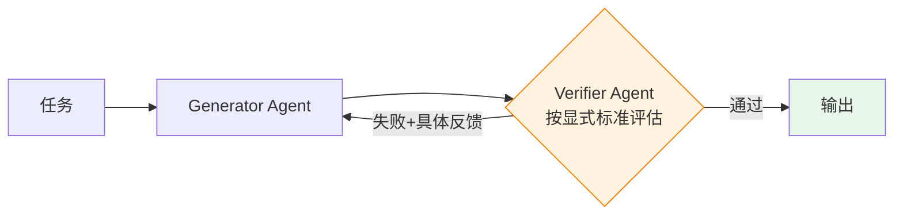
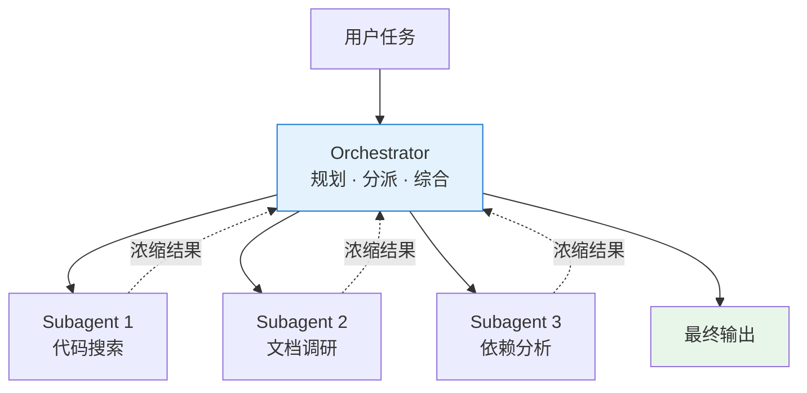
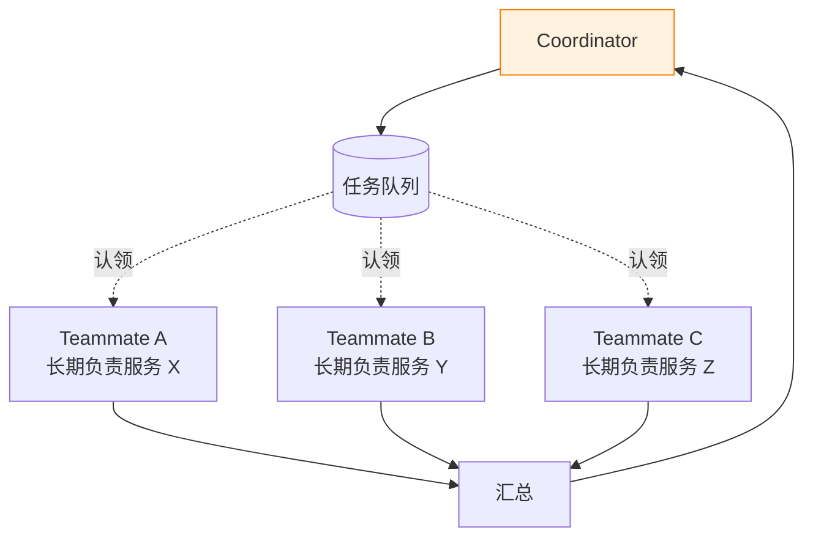
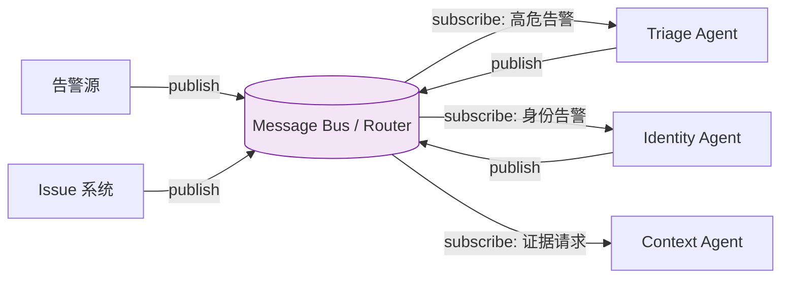
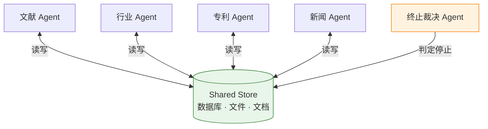
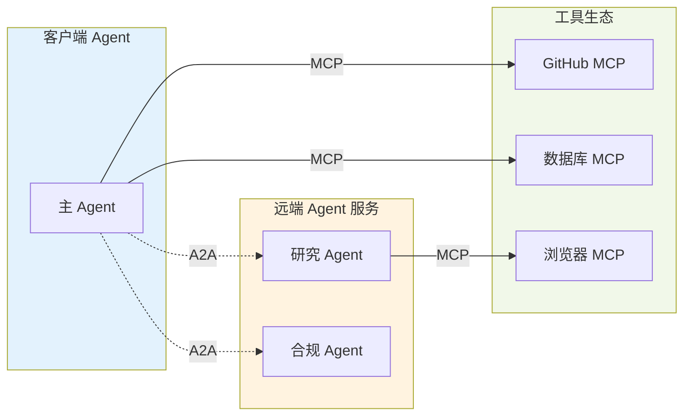
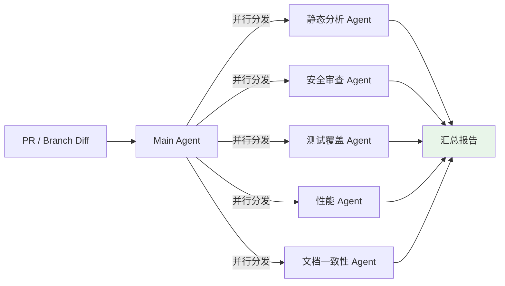
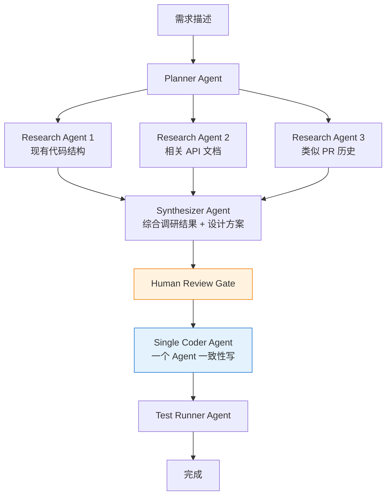

## 引言

2026 年的 AI Coding 已经不是新鲜事。主流 IDE 基本都内置了编码助手，单 Agent 编码工具（Claude Code、Cursor、Codex、Copilot Agent Mode）在日常开发中承担了显著比例的代码产出。Stack Overflow 和 DORA 调查都显示，超过 80% 的一线工程师每天都会和某种 AI 编码工具协作。

但真正让人兴奋的不再是"AI 会不会写代码"，而是另一个问题：

> 当单个编码 Agent 已经足够强，再往前一步的生产力该从哪里来？

越来越多的团队给出的答案是 **Multi-Agent**——多个 Agent 并行、分工、互相协作。它听起来很美好，但实际用起来却充满陷阱：Cognition 公开撰文劝退多 Agent，Anthropic 则用一个研究系统反向论证多 Agent 的威力，LangChain 专门做了 Benchmark 来对比不同架构。这场争论到 2026 年仍然没有完全收敛。

本文试图把这团乱麻梳理清楚。我们会从架构讲到框架，从行业动态讲到协议标准化，最后回到最实用的问题：**在 AI Coding 已经相对成熟的今天，如何用 Multi-Agent 思路继续往前推动个人和团队的生产力**。

---

## 为什么现在讨论 Multi-Agent

### 单 Agent 的三个瓶颈

哪怕是最好的单 Agent 编码工具，也会在三个地方碰壁。

第一是**上下文容量**。即使有 200K、1M token 的模型，一旦任务横跨多个模块、多个仓库，或者需要同时持有代码、文档、日志、对话历史，Agent 很快就会在噪声里迷失方向。典型症状是：越往后越重复、越保守、甚至开始遗忘前面的决策。

第二是**任务耦合**。一个 Agent 在一个任务里同时要处理阅读代码、写代码、跑测试、改文档、对比设计——每一项都会抢占同一段"注意力"。这就像让一个工程师同时用一块白板处理四件事，切换成本极高。

第三是**可并行性缺失**。很多工程任务本质上是可以并行展开的：研究认证模块、研究数据层、研究 API 层，三件事之间没有强依赖。但一个 Agent 是串行推进的，这种天然的并行红利拿不到。

### 两派观点：Cognition vs Anthropic

2025 年 6 月的"Multi-Agent 大辩论"是理解当下格局的关键。

Cognition（Devin 的团队）在 [《Don't Build Multi-Agents》](https://cognition.ai/blog/dont-build-multi-agents)中提出一个尖锐观点：**多 Agent 系统在写任务上天然脆弱**。核心原因是上下文不共享、决策发散。当两个 Agent 各写一部分代码，它们很可能对同一个函数签名做出相反的假设，最终合并出一个"看起来都对、整体不自洽"的产物。

Anthropic 不到 24 小时后发出 [《How we built our multi-agent research system》](https://www.anthropic.com/engineering/multi-agent-research-system)，用一个正式上线的研究系统反向证明：**多 Agent 在读任务（信息收集、研究、分析）上可以带来 90% 以上的质量提升**，代价是约 15 倍的 token 消耗。

两派其实并不矛盾。真正的区分点在**任务的可分解性**和**读写比例**：

| 维度 | 偏向单 Agent | 偏向 Multi-Agent |
|------|-------------|-----------------|
| 任务类型 | 写任务（代码、文档、产物） | 读任务（研究、搜索、分析） |
| 决策一致性 | 要求高 | 要求相对低 |
| 子任务依赖 | 强耦合 | 弱耦合、可并行 |
| Token 预算 | 受限 | 充裕 |
| 延迟容忍 | 需要同步交互 | 可以后台跑十几分钟 |

理解这张表，很多"要不要上多 Agent"的问题就不再是口味之争。

---

## Multi-Agent 架构全景

讲架构之前先澄清一个常见的混淆：社区里"Orchestrator-Worker / Supervisor / Swarm"是**按框架实现命名**，而 Anthropic 在 [Multi-agent coordination patterns](https://www.anthropic.com/engineering/multi-agent-coordination-patterns) 里把协作模式按**信息结构**整理成了 5 种主流范式——Generator-Verifier、Orchestrator-Subagent、Agent Teams、Message Bus、Shared State。后一种分类更贴近"这个系统到底怎么流转信息"这个问题，也更利于选型。

在展开 5 种模式之前，需要先理解它们共享的一个核心原则。

### 核心原则：Context-Centric Decomposition

> 按每个 Agent 所需的 **context** 划分工作，而不是按**工作类型**划分。

这是整个 Multi-Agent 设计空间的底层公理。传统的"按工作类型分解"——前端 Agent / 后端 Agent / 测试 Agent——常常踩坑：每个 Agent 为了完成自己的任务都需要大量背景 context，而这些 context 又大量重叠。几个 Agent 分别维护着相似的庞大 context window，并行带来的速度收益被 token 成本和协调开销抵消。

Context-Centric Decomposition 反过来问：**"一个完整任务单元真正需要哪些信息？"** 让这组信息成为一个 Agent 的全部视野。边界自然落在**信息需求的断层处**，而不是工作类型的分界。

这个原则还反向告诉你**什么时候不该拆**：如果任务的 context 紧密耦合、无法干净切分，强行拆 Agent 只会让信息在 Agent 间反复转手丢失。很多"多 Agent 不好用"的抱怨，根源都是边界画错了地方。

### 五种主流协作模式

下面五种模式按复杂度递增，覆盖了目前生产系统里绝大多数形态。

#### 模式 1：Generator-Verifier（生成-验证）

**机制**：Generator 产出初始输出，Verifier 按**显式标准**评估，通过则完成，失败则带着具体反馈返回 Generator，循环直到通过或触顶。Generator 本身可以是一个完整的 orchestrator，Verifier 可以是更轻量的 Agent。



**适用**：质量关键且评估标准能被写下来的任务——代码生成 + 测试、事实核查、rubric 评分、合规审查、客服邮件生成。

**关键失败模式**：

- **橡皮图章 Verifier**：只告诉它"检查输出是否好"而不给明确标准，它会盖章通过一切，制造出质量控制的错觉。
- **生成-验证不可分离**：如果"判断一个方案好坏"和"产生它"一样难，Verifier 无法可靠捕捉问题。
- **不收敛的循环**：Generator 无力处理反馈时系统在原地震荡。必须设最大迭代数 + fallback（升级人、返回尽力而为 + 警告）。

#### 模式 2：Orchestrator-Subagent（编排者-子代理）

**机制**：Orchestrator 接收任务、规划分解、一部分自己做，另一部分派发给 specialized subagent。Subagent 在**独立 context** 中工作，完成后把**浓缩结果**返回 orchestrator，不与其他 subagent 直接通信。Orchestrator 综合所有结果。



**适用**：任务分解清晰、子任务间依赖最小、每个子任务**一次调用**即可返回确定结果（bounded invocation）。

**典型案例**：**Claude Code 的主干架构**——主 Agent 写代码、编辑文件、运行命令，同时在后台分派 subagent 去搜索大代码库、调研独立问题，主 Agent 的 context 保持聚焦。Anthropic 研究系统、Claude Code subagents、自动 PR 审查管道都是这种形态。

**关键失败模式**：

- **Orchestrator 信息瓶颈**：一个 subagent 的发现对另一个很关键，但必须经过 orchestrator 中转；Orchestrator 没识别这种依赖时，关键细节会被过度总结或直接丢失。
- **默认顺序执行**：不显式并行化时 subagent 串行跑，付出多 Agent 的 token 代价却没拿到速度收益。
- **跨 Agent 依赖识别负担**：Orchestrator 必须主动推断"A 的发现会影响 B 的分析"并正确路由——这是整个模式里认知负载最高的一环。

#### 模式 3：Agent Teams（代理团队）

**机制**：Coordinator 启动多个独立进程的 **长期存活 worker**（teammate）。Teammate 从共享任务队列中认领任务，自主跨多步完成，**在任务之间持续存活**，累积领域 context 和专业化能力。



**与 Orchestrator-Subagent 的关键差异**：subagent 是**一次性**的，完成一个有界子任务后终止，下次任务重新生成干净的；teammate 是**长期存活**的，跨多次分派累积对自己领域的熟悉度（依赖图、测试模式、部署配置），这种累积在 one-shot 调度下无法复现。

**适用**：子任务独立、多步、长时间，每个 worker 有明确"领域"，累积 context 能显著提升后续性能。典型案例是大型代码库的跨框架迁移，每个 teammate 负责一个服务的完整迁移，反复操作同一服务逐渐掌握它的依赖图与测试模式。

**关键失败模式**：

- **强独立性要求**：Teammate 间没有直接通信通道，若一个 teammate 的工作影响另一个的结果，双方互不知情会产出冲突。
- **完成检测困难**：Teammate 耗时高度不均（2 分钟 vs 20 分钟），coordinator 必须处理部分完成。
- **共享资源冲突**：多 teammate 同时操作同一代码库、数据库、文件系统会互相覆盖，需要精细的任务分区与冲突解决。

#### 模式 4：Message Bus（消息总线）

**机制**：Agent 之间通过两个原语通信——**publish**（发布事件到主题）和 **subscribe**（订阅感兴趣的主题）。中央 router 把匹配的消息投递给对应 Agent。新的 Agent 类型可以在不改动既有连接的情况下加入生态，只需声明它订阅哪些主题。工作流从实际事件中**涌现**，而非预定义顺序。



**适用**：事件驱动管道，路径由发生的事件动态决定；Agent 生态预期会持续增长；多个团队希望独立开发、独立部署各自的 Agent。

**典型案例**：安全运维自动化——多来源告警进入系统，triage Agent 分类，高危告警路由到网络调查 Agent，凭据类告警路由到身份分析 Agent；调查过程中可以 publish 增强请求，由 context Agent 响应。新威胁类别出现时只需新增订阅对应主题的 Agent，不动已有管道。

**关键失败模式**：

- **追踪调试困难**：事件级联穿越多 Agent 时，重建"发生了什么"需要精细的 correlation ID 与结构化日志。
- **Router 判错静默失败**：系统不崩溃但什么都没做；需要"无订阅者主题告警"和定期事件采样。
- **LLM router 的不确定性**：用 LLM 做语义路由带来灵活性但自身可能判错，而这种错误没有清晰的异常信号。

#### 模式 5：Shared State（共享状态）

**机制**：**去中心化**——Agent 不经过 orchestrator 或 router，直接通过所有成员都可读写的持久化 store（数据库、文件系统、共享文档）协作。每个 Agent 自主读取相关信息、行动、把发现写回。从"写入种子问题"开始，到满足终止条件（时间预算、收敛阈值、专职"终止裁决"Agent）时结束。



**适用**：协作研究——Agent 的工作需要**实时基于彼此发现调整**；需要消除协调者作为单点故障；Store 本身就应成为不断积累的知识库。

**关键失败模式**：

- **反应式循环（最危险）**：A 写入发现 → B 读到后写后续 → A 看到 B 的后续又响应……系统持续烧 token 却不收敛。这是**行为层问题**，不能靠锁/版本/分区等工程手段解决。
- **行为涌现不可预测**：无显式协调时 Agent 可能重复工作或走向相互矛盾的方向。
- **终止条件必须是一等公民**：时间预算、"N 轮无新发现"阈值、专职裁决 Agent。把终止当事后补丁的系统要么无限循环，要么在某个 Agent 的 context 填满时任意停止。

### 模式对比速查

| 维度 | Generator-Verifier | Orchestrator-Subagent | Agent Teams | Message Bus | Shared State |
|------|-------------------|----------------------|-------------|-------------|--------------|
| 控制结构 | 循环闭环 | 单层中心化 | Coordinator + 长期 worker | 去中心化路由 | 完全去中心化 |
| Worker 生命周期 | 每轮重生 | 一次性 | 长期存活 | 事件触发 | 持续运行 |
| 工作流形态 | 预定义循环 | 预定义分派 | 队列认领 | 事件涌现 | 共享写入涌现 |
| 横向通信 | 无 | 无（必经 orchestrator） | 无（独立分区） | 通过 bus | 通过 store |
| 调试难度 | 低 | 中 | 中 | 高 | 高 |
| 典型框架/产品 | 单元测试 + 修复循环、SWE-agent reviewer | Claude Code、Anthropic Research、LangGraph Supervisor | LangGraph + 长生命 worker、Codex cloud runner | 事件驱动编排、Kafka-style 管道 | 协作研究系统、知识库累积 |

> 社区里常说的 **LangGraph Supervisor** 是 Orchestrator-Subagent 的多层版本；**OpenAI Agents SDK 的 Swarm/Handoff** 介于 Orchestrator-Subagent 和 Message Bus 之间（没有 bus，但 handoff 机制让 Agent 之间可以横向"接力"）。这些框架命名都能映射到上面 5 种模式之一或组合。

### 如何选型：两层决策

决定"要不要上多 Agent"和"选哪种模式"是两个独立的问题，按顺序回答。

**第一层：是否真的需要多 Agent**

先确认以下四个价值场景至少成立一个：

- **Context 隔离**——主会话容易被无关细节污染
- **并行化**——子任务真有独立可并行的结构
- **专业化**——不同阶段要求不同权限 / 提示词 / 模型
- **无偏见复核**——需要一个不受主会话假设影响的独立评估

四个都不成立，老老实实用单 Agent。多 Agent 不会让任务自动变简单，只会把 token、协调、调试成本乘上一个系数。

**第二层：选择哪种模式**

按下面的二分决策递进：

| 问题 | 选 A | 选 B |
|------|------|------|
| Worker 是否需要跨调用保留 context？ | **Orchestrator-Subagent**（一次性） | **Agent Teams**（长期存活） |
| 工作流能否预先定义？ | **Orchestrator-Subagent** | **Message Bus**（事件驱动） |
| Agent 之间是否需要实时互享发现？ | **Agent Teams**（独立分区） | **Shared State**（共享读写） |
| 工作是离散事件还是累积知识？ | **Message Bus**（事件管道） | **Shared State**（知识库） |
| 是否需要质量闸门且标准可显式？ | — | **Generator-Verifier** |

**经验起点**：**Orchestrator-Subagent 覆盖面最广、协调开销最小。先上它，再按瓶颈演化**——

- 子任务明显需要长期领域 context → 迁到 Agent Teams
- Orchestrator 内的条件路由逻辑越来越臃肿 → 迁到 Message Bus
- Agent 间反复要求 orchestrator 中转发现 → 迁到 Shared State
- 输出质量要求一个独立的把关环节 → 在现有架构外套一层 Generator-Verifier

不要因为"听起来高级"就一步跳到 Shared State 或 Message Bus。**复杂度应该按实际瓶颈递进**，而不是预先设计满。

### 组合模式：模式是积木，不是互斥选项

真实生产系统经常同时使用多种模式，它们之间并不冲突。常见组合：

- **Orchestrator + Shared State**：外层流程由 orchestrator 控制阶段，某个协作密集的子阶段（多源研究）改用 shared state
- **Message Bus + Agent Teams**：Bus 负责路由事件，每类事件由一个长期存活的 team 消费
- **Orchestrator + Generator-Verifier**：主流程分派任务，每个关键产出额外走一遍 verifier
- **分层 Orchestrator**：顶层 orchestrator 调度若干子 orchestrator，每个子 orchestrator 再分派 subagent——处理大规模复杂任务的常见形态

架构的复杂度应该按业务复杂度**逐段生长**，而不是从第一天就搭满。一个务实的路线是：**从 Orchestrator-Subagent 起步，遇到真瓶颈再引入下一种模式**。

---

## 主流框架横向对比

理解了架构模式后，我们看看业界流行的几个框架是怎么落地这些模式的。

### 四大框架的设计哲学

| 框架 | 核心抽象 | 心智模型 | 强项 |
|------|---------|---------|------|
| **LangGraph** | 状态图（Node + Edge + State） | 带 LLM 节点的有限状态机 | 可控性、可观测性、分支与循环 |
| **CrewAI** | 角色（Role + Goal + Backstory） | 一支有明确职责的小团队 | 上手快、线性流程直观 |
| **AutoGen** | 异步 Actor 消息 | 一场 Agent 间的 group chat | 对话驱动、迭代性任务 |
| **OpenAI Agents SDK** | Agent + Handoff | 轻量的 Agent 接力 | 简洁、教学友好、Agent 运行时完备 |
| **Claude Agent SDK** | Agent + Subagent + Tools | 主 Agent + 可调度的专职 subagent | 与 Claude Code 生态原生打通 |

### 如何选择

实际选型可以用三个问题来过滤：

**1. 你的工作流是状态机还是对话？**
如果有明确的阶段、分支、循环、回退——优先 LangGraph。如果是 Agent 之间自然对话、互相纠偏——AutoGen。

**2. 你更在意可控性还是易上手？**
要上生产、要可追溯、要人工审批插钩——LangGraph。只是想做个 Demo、或者团队角色分工简单——CrewAI。

**3. 你已经在谁的生态里？**
团队已经深度用 Claude 的 agentic 能力——Claude Agent SDK。团队在 Azure / OpenAI 生态——OpenAI Agents SDK。团队已经在 LangChain 栈——LangGraph。

LangChain 官方在 [《How and when to build multi-agent systems》](https://blog.langchain.com/how-and-when-to-build-multi-agent-systems/) 的 Benchmark 里发现了一个反直觉的结论：**Supervisor 的 routing overhead 可能占到响应时间的 30% 以上**。这意味着在延迟敏感的场景（例如实时编辑器协同），架构的选择直接影响用户体验。

### Worker-Leader 架构：组织级治理层

2025 年底 LangChain 和 Cisco 联合提出的 [Agentic Engineering](https://blog.langchain.com/agentic-engineering-swarms-of-ai-agents-redefining-software-engineering/) 为大规模生产部署补了一种形态——**Worker-Leader Architecture**。它表面上像 Orchestrator-Subagent，但关键差异在 Leader 层：

- **Orchestrator-Subagent**：Orchestrator 主动分派**单次任务**，subagent 无持久化记忆，聚焦单次任务分解。
- **Worker-Leader**：Worker 自主运行于清晰边界内，Leader 不直接下达任务，而是提供**持续治理层**——共享提示词/工作流库、统一工具网关、全局长期记忆、跨 Worker 的可观测性。Worker 与 Leader 通过 A2A 协议通信，外部不支持 A2A 的 Agent 可通过 MCP wrapper 接入。

换个角度看，Worker-Leader 其实是把 Harness 提升到**组织层面**：单个 Worker 内部有自己的小 harness，Leader 则是跨 Worker 的 meta-harness。适合几十上百个 Agent 跨团队共同运营的企业场景，不适合小团队起步。

如果你现在只在一个项目里跑几个 subagent，不需要 Worker-Leader；但当 Agent 数量增长到跨团队、跨项目共用时，会自然演化到这个形态。

### LangGraph Supervisor 最小示例

```python
from langgraph.graph import StateGraph, END
from langgraph_supervisor import create_supervisor
from langchain_core.tools import tool

@tool
def search_code(query: str) -> str:
    """在仓库中搜索匹配 query 的代码片段"""
    ...

@tool
def write_patch(path: str, content: str) -> str:
    """把 content 写入指定文件"""
    ...

researcher = create_react_agent(
    name="researcher",
    tools=[search_code],
    prompt="你是代码研究员，只负责读和分析，不写入任何文件。",
)

coder = create_react_agent(
    name="coder",
    tools=[write_patch],
    prompt="你是代码实现者，基于 researcher 的发现产出代码补丁。",
)

supervisor = create_supervisor(
    agents=[researcher, coder],
    prompt=(
        "你是项目协调人。先让 researcher 产出一份调研摘要，"
        "再把摘要和具体修改任务传给 coder。"
        "coder 产出补丁后由你审阅并结束任务。"
    ),
)

app = supervisor.compile()
```

几个值得注意的细节：`researcher` 被明确约束"不写入文件"，这是避免写写冲突的基本纪律；`supervisor` 的 prompt 里显式描述了顺序，而不是让它自己发挥——生产环境的 Supervisor 越保守越可靠。

---

## 行业关键进展（2025–2026）

Multi-Agent 在过去一年多发生的大事，远不止架构层面的讨论。

### MCP：工具侧的标准化

[Model Context Protocol（MCP）](https://modelcontextprotocol.io) 由 Anthropic 在 2024 年末提出，到 2025 年已经被 OpenAI、Google、主流 IDE 厂商全面接入。它解决的是 **Agent 和外部工具之间的连接标准**：一个工具只要实现了 MCP Server 规范，任何支持 MCP 的 Agent 都能直接使用。

在 Multi-Agent 语境下，MCP 有两层价值：

- **统一工具层**：多个 Agent 访问同一组工具时，不需要各自写一套 adapter。
- **能力解耦**：可以把某个 Agent 整体包成 MCP Server，对外只暴露 Agent Card，内部实现可以自由替换。

### A2A：Agent 之间的标准化

2025 年 4 月由 Google 发起、后进入 Linux Foundation 的 [Agent2Agent (A2A) 协议](https://a2a-protocol.org/latest/) 解决的是另一个问题：**不同组织、不同框架的 Agent 之间如何对话**。

A2A 的核心三件事：

1. **Agent Card**：以 JSON 形式描述一个 Agent 的能力、输入输出、身份认证要求，相当于 Agent 的"名片"。
2. **任务语义**：通信以"完成一个任务"为单位，而不是一次性的函数调用。
3. **消息 parts**：消息由多个"part"组成，每一个 part 有独立语义（文本、结构化数据、文件引用）。

MCP 和 A2A 其实是互补关系——一个管 Agent 对工具、一个管 Agent 对 Agent：



到 2026 年，A2A 已经聚集了 50+ 企业合作伙伴，包括 Atlassian、Box、Salesforce、ServiceNow 等。这意味着一件事：**Multi-Agent 的未来不会是所有 Agent 都跑在同一个框架里，而是各家 Agent 通过标准协议互联**。

### SWE-bench 上的 Agent 成绩

2024 年年初 SWE-bench Verified 刚推出时，顶尖模型在 Verified 500 题上能做对 30% 就是新闻。到 2025 年底，这个数字已经被推到 77% 以上（[Gemini 3 Pro + Live-SWE-agent](https://live-swe-agent.github.io/) 在 2025 年 11 月拿到 77.4%）。

关键驱动因素不是模型本身变强那么简单。看近一年 Leaderboard 的 top 方案，几乎都具备以下结构：

- **多轮 plan-act-reflect 循环**（单 Agent 内部的"自我多智能体化"）
- **独立的 reviewer / critic agent** 对 diff 打分、要求重写
- **显式的修复与验证阶段分离**，不是"一写到底"
- **多种工具手**（search、run、read、edit）清晰切分

换句话说，哪怕名义上是"单 Agent"，内部几乎都已经隐式地是 Multi-Agent。更硬核的 [SWE-Bench Pro](https://labs.scale.com/leaderboard/swe_bench_pro_public) 上顶尖系统还只能做到 23% 左右——说明真实项目级别的编码，Multi-Agent 仍有很大的提升空间。

---

## Multi-Agent 在 AI Coding 中的实践

到了本文最实用的部分：**在 2026 年，一个工程师或一支团队能怎么用 Multi-Agent 真实地提升生产力？**

### 心智转变：从"结对编程"到"管理一支团队"

Addy Osmani 在 [《Conductors to Orchestrators》](https://addyosmani.com/blog/future-agentic-coding/)里用了一个很好的类比：

- **Conductor 模式（单 Agent）**：你和一个 AI 实时结对，每一步都确认，节奏像是管弦乐队里的指挥，容不得脱节。
- **Orchestrator 模式（多 Agent）**：你像在管理一个小团队。你规划工作、分配任务、定期 check-in，团队成员各自异步推进。

这个转变的影响比听起来更大。它意味着：

- 你的注意力从"现在这一行写得对不对"转移到"整个任务是不是被分得合理"。
- 你花在 prompt 上的时间可能减少，但花在**任务结构设计**和**结果 review** 上的时间会增加。
- 一些过去因为"我做更快"就自己做的小事，现在值得交给一个专职 subagent。

### 实战模式一：并行 Code Review

这是最容易立刻见效的用法。一个完整的 Code Review 本质上是多个正交维度的检查，天然适合并行：



在 Claude Code 里可以通过 subagents 配置来实现。一个 `security-reviewer` subagent 的定义文件大致长这样：

```yaml
# .claude/agents/security-reviewer.md
---
name: security-reviewer
description: 对 diff 进行安全审查，专注于注入、鉴权、密钥泄露等风险
tools:
  - Read
  - Grep
  - Bash  # 仅允许只读命令
---

你是一个专职安全审查员。只做两件事：
1. 指出 diff 中可能的注入、鉴权绕过、密钥泄露、不安全依赖
2. 给出最小修复建议

不要重写代码，不要评论代码风格，不要评论测试覆盖。
每条发现以 [severity] path:line: 描述 格式输出。
```

然后在主 session 里用一条指令触发并行：

```bash
# 让主 Agent 同时调起 5 个专职审查 subagent
对当前 branch diff 运行：
static-analyzer, security-reviewer, test-reviewer,
perf-reviewer, doc-consistency-reviewer
并将各自结果合并成一份按严重度排序的报告。
```

几点工程化细节：

- **给每个 subagent 极窄的职责**。越窄，噪声越低，报告越可读。
- **限制工具权限**。审查类 subagent 不应该有 Write 权限；不给它机会"顺手改一下"。
- **在 prompt 里明确不做什么**。这比"告诉它做什么"更能降低越界。

### 实战模式二：异步长任务拆分

当任务不是 5 分钟就能跑完，而是要几十分钟甚至小时级（重构、大规模迁移、文档生成），同步盯着一个 Agent 是巨大的浪费。这是 Claude Code Agent Teams、Codex cloud runner、Devin 这类异步 Agent 最适用的场景。

推荐的节奏：

1. **自己先写一份 plan.md**：明确目标、约束、验收标准、拆分建议。
2. **把 plan 交给 Lead Agent 做进一步分解**（而不是一开始就让它从零规划）。
3. **Lead 把每个子任务派给一个独立 worker（或一个独立的 cloud session）**，worker 之间**不共享写权限**（避免写写冲突）。
4. **约定好每个 worker 只动一个目录或一组文件**。
5. **每隔 15 分钟或每个 worker 完成，自己 check in 一次**，调整 plan。

这里的核心纪律是：**每个 worker 的"领地"不重叠**。只要做到这一点，Cognition 警告的"context 不共享导致决策冲突"就大部分被规避了——因为决策根本不会发生在同一片代码上。

### 实战模式三：研究-实现分离

这是 Anthropic 研究系统的直接移植，对写复杂新功能特别有效：



几个关键设计：

- **读任务用多 Agent 并行**（这是 Anthropic 验证过 90% 质量提升的场景）。
- **写任务由单 Agent 一致性完成**（这是 Cognition 反复强调的要点）。
- **中间插入一个人工 review gate**，这是目前多 Agent 最实用的"安全阀"。

### 实战模式四：测试驱动的自愈循环

这是目前 SWE-bench 顶尖系统普遍使用的结构：

```python
# 伪代码
while not tests_pass:
    diff = coder.generate_patch(failing_tests, context)
    apply(diff)
    result = run_tests()
    if result.passed:
        break
    critic_notes = critic.review(diff, result.failures)
    context.append(critic_notes)
    if iteration > max_iter:
        escalate_to_human()
```

这里的 `coder` 和 `critic` 是两个独立 Agent（不同 prompt、不同 role），即便底层可能是同一个模型。让它们分离而不是让一个 Agent "又写又评"的原因是：**同一个 Agent 对自己的产物天然有确认偏差**。把角色拆开，批评的声音才真的独立。

### 不要用 Multi-Agent 的信号

反过来讲，下面这些情况不建议上多 Agent：

- **任务一气呵成，子任务之间强依赖**（典型：单文件重构）——步骤 2 需要步骤 1 的完整输出，硬拆 subagent 只会让状态在文件间反复传递。
- **同文件的并发编辑**——两个 Agent 并行改同一个文件是冲突配方，紧耦合的修改应该放在一个 context 里。
- **延迟敏感、每次回应都要小于 2 秒**（典型：IDE 内联补全）——任何跨 Agent 的往返都会打破这个预算。
- **Token 预算有限**——Multi-Agent 的 token 消耗经验值是单 Agent 的 5–20 倍，Anthropic 研究系统实测约为 **15 倍**。
- **过多 specialist subagent**——定义一堆专家看起来很强，但会稀释自动委派的信号，让路由变得不可靠。多数团队最后都落在"少而精"的一小组 agent。
- **团队还没把单 Agent 的工程化做扎实**——context 管理、权限、工具描述、日志没有做好之前，多 Agent 只会把问题放大数倍。

### 失败模式速查

按模式把最常见的踩坑和预防做法整理成一张表，建立系统前后都值得回看一遍：

| 模式 | 最常见失败 | 预防做法 |
|------|-----------|---------|
| Generator-Verifier | Verifier 没有明确标准，变成橡皮图章 | 把评估标准显式写入 verifier 提示词，每条都要可验证 |
| Generator-Verifier | 循环不收敛，反复改也过不了 | 最大迭代数 + fallback（升级人、返回尽力而为 + 警告） |
| Orchestrator-Subagent | 跨 subagent 的依赖信息被过度总结丢失 | Orchestrator 主动识别依赖并显式路由；或改用 Shared State |
| Orchestrator-Subagent | 默认串行，付了钱没拿到速度 | 明确提示或代码层并行分派，观察实际耗时 |
| Agent Teams | 多 teammate 并发操作共享资源产生冲突 | 任务分区 + 版本/锁机制，teammate 的"领地"不重叠 |
| Agent Teams | 完成检测不一致，部分完成难处理 | 心跳机制 + 支持部分完成的汇总协议 |
| Message Bus | 事件级联穿越多 Agent 后无法追踪 | 强制 correlation ID + 结构化日志 |
| Message Bus | Router 误判造成静默失败 | 对无订阅主题告警、定期事件采样校验 |
| Shared State | 反应式循环持续烧 token 却不收敛 | 终止条件作为一等公民设计：时间预算、收敛阈值、裁决 Agent |
| Shared State | 行为涌现不可预测 | 收敛检查 + 专职裁决 Agent，定期快照 store 的差分 |

这张表背后的共同逻辑是：**多 Agent 系统的故障多半不在单个 Agent 内部，而在 Agent 之间的信息流**。写 Agent 提示词时容易聚焦于"这个 Agent 该做什么"，但真正决定系统能不能跑得稳的是"信息在 Agent 之间怎么流转"。

---

## 面向未来：Multi-Agent 的下一步

### 长期记忆与状态共享

到 2026 年，Multi-Agent 最大的未解问题是**记忆**。[ICLR 2026 的 MemAgents Workshop](https://openreview.net/pdf?id=U51WxL382H) 系列论文已经把这件事明确列为"最紧迫的开放问题"。

挑战有两层：

1. **单 Agent 的长期记忆**：如何让一个 Agent 的知识在几小时、几天、几周后仍然有效，而不是每次都从零读代码。
2. **多 Agent 的共享记忆**：几个 Agent 同时读写同一个知识池，如何保证一致性？如何避免互相覆盖？

主流方向有两派：**共享内存池**（易于复用、需要一致性协议）和**分布式记忆**（每个 Agent 自有、按需同步）。目前还没有事实标准，这是接下来 12–18 个月值得紧跟的方向。

### 协议层的持续沉淀

MCP 和 A2A 之外，可以预期未来一两年会出现更多针对 Multi-Agent 的基础协议：

- **统一的 Agent 身份与鉴权**：如何让一个外部 Agent 在有限权限下访问你的系统。
- **统一的任务流（task flow）描述**：目前每个框架对"任务"的表达都不一样，跨框架交互会越来越痛。
- **统一的观测协议**：生产系统必须能追踪每个 Agent 的决策链，OpenTelemetry for Agents 是一个雏形方向。

### 从"团队"到"组织"

当 Multi-Agent 稳定运转，下一个扩展方向是**Agent 组织**：一个企业里跑着几十上百个 Agent，它们各自属于不同团队，服务不同业务。这时的难题不再是"如何让两个 Agent 协作"，而是：

- 权限如何跨 Agent 传播（类似 IAM，但针对 Agent）。
- 成本如何归因（一个调用链穿过 10 个 Agent，token 怎么算账）。
- 安全边界如何维护（一个外部 Agent 被攻破，不能影响整个组织）。

这些问题都不是模型层面能解决的，需要工程、平台、安全的协同。这也是为什么 Gartner 预测到 2026 年底，40% 的企业应用会嵌入任务级 Agent——从 2025 年的不到 5%——但真正跑得稳的组织级 Multi-Agent 部署仍然是少数。

### 对开发者的现实建议

不要等待终极架构。以 2026 年可用的工具为基准：

- 今天就可以在你的日常工作流里加入 **Code Review subagent**（Claude Code / Cursor 都支持）。
- 本周就可以把一个以前要手搓一下午的研究任务，写成一个**研究-实现分离**的 plan，让 Agent 异步跑。
- 本月可以尝试把自己常用的几个任务封装成 **subagent 配置文件**，让团队共享。
- 本季度可以对一两个关键流程（例如"从 issue 到 PR"）建一条完整的 Multi-Agent pipeline，并加上可观测性。

Multi-Agent 不是银弹，它只是一种新的组织工作方式。你不会因为写了一个 subagent 就突然"变强"，但你会发现自己开始以"项目经理"的方式思考编码任务——而这种思维转变本身，就是未来几年最重要的生产力升级。

---

## 结语

Multi-Agent 到 2026 年走到了一个微妙的阶段：架构模式基本定型，框架选择不再是稀缺问题，协议标准开始成型，但真正稳定跑在生产环境的大规模多 Agent 系统仍然是少数。

回到最开始的问题——在 AI Coding 已经成熟的今天，下一步的生产力从哪里来？答案可能不是"更强的单一 Agent"，而是**更好的任务分解能力**、**更清晰的职责分配**、**更扎实的工程化底座**。

Multi-Agent 既不是 Cognition 描述的"脆弱陷阱"，也不是某些宣传稿里的"自动化银弹"。它是一种**值得慎重引入的工程模式**，用在对的任务上回报很高，用错了地方代价也很大。

对工程师个人而言，现在最有价值的投资不是等到某个完美框架出现，而是：**在日常工作里主动观察哪些任务天然适合拆成多个 Agent**，然后用最简单的结构跑起来，迭代着向前。等到工具生态再进化一轮，你已经习惯了以 Orchestrator 的方式思考——那才是真正难以被替代的能力。

---

## 延伸阅读

- [Building Effective AI Agents](https://www.anthropic.com/research/building-effective-agents) — Anthropic 官方的 Agent 设计五大工作流模式
- [Multi-agent coordination patterns](https://www.anthropic.com/engineering/multi-agent-coordination-patterns) — Anthropic 对 5 种主流协作模式（Generator-Verifier、Orchestrator-Subagent、Agent Teams、Message Bus、Shared State）的系统梳理
- [How we built our multi-agent research system](https://www.anthropic.com/engineering/multi-agent-research-system) — Anthropic 研究系统的 Orchestrator-Subagent 架构复盘
- [How and when to use subagents in Claude Code](https://www.anthropic.com/engineering/how-and-when-to-use-subagents-in-claude-code) — Claude Code subagent 的设计边界与典型用法
- [Don't Build Multi-Agents](https://cognition.ai/blog/dont-build-multi-agents) — Cognition 对多 Agent 在写任务上脆弱性的直接论证
- [How and when to build multi-agent systems](https://blog.langchain.com/how-and-when-to-build-multi-agent-systems/) — LangChain 针对多 Agent 架构的 Benchmark 与选型建议
- [Benchmarking Multi-Agent Architectures](https://blog.langchain.com/benchmarking-multi-agent-architectures/) — Supervisor vs Swarm 的量化对比
- [Agentic Engineering — Swarms of AI Agents Redefining Software Engineering](https://blog.langchain.com/agentic-engineering-swarms-of-ai-agents-redefining-software-engineering/) — LangChain × Cisco 的 Worker-Leader 架构实践
- [Agent2Agent Protocol](https://a2a-protocol.org/latest/) — A2A 协议官方规范
- [Model Context Protocol](https://modelcontextprotocol.io) — MCP 协议文档与生态
- [OpenAI Agents SDK](https://openai.github.io/openai-agents-python/) — OpenAI Swarm 的生产级演进
- [LangGraph Documentation](https://langchain-ai.github.io/langgraph/) — 状态图驱动的多 Agent 框架
- [Create custom subagents — Claude Code Docs](https://code.claude.com/docs/en/sub-agents) — Claude Code subagents 配置与最佳实践
- [Conductors to Orchestrators: The Future of Agentic Coding](https://addyosmani.com/blog/future-agentic-coding/) — Addy Osmani 关于 AI Coding 范式转变的经典论述
- [SWE-bench Verified Leaderboard](https://www.swebench.com/verified.html) — Agent 编码能力的主流评测榜单
