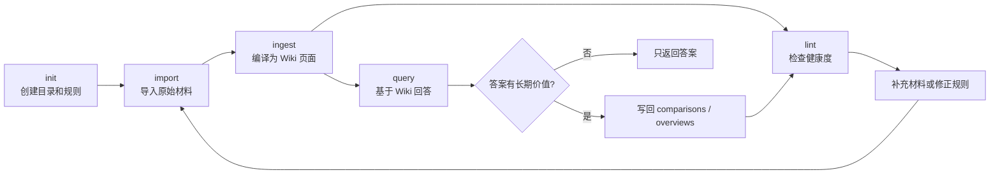

## 引言

过去两年，很多人已经习惯了把 PDF、网页、会议记录丢给 AI，然后让它总结、对比、回答问题。这个工作流很直接，也确实有用，但它有一个隐蔽的问题：**每一次对话都像从零开始**。

你今天让 AI 读五篇文章，得到一份不错的分析。过两周再问一个相近但更细的问题，AI 往往又要重新检索、重新拼接、重新推理。上一次对话里的判断、交叉引用和矛盾点，除非你手动整理，否则大多留在聊天记录里。

Andrej Karpathy 在 [llm-wiki.md](https://gist.github.com/karpathy/442a6bf555914893e9891c11519de94f) 里提出的 LLM Wiki 范式，正是针对这个痛点：让 LLM 不只是临时回答问题，而是持续维护一个结构化、可追溯、可增长的 Wiki。人负责选择材料和提出问题，LLM 负责摘要、归档、交叉引用和日常维护。

本文基于这个公开思路，讨论一种更贴近日常协作环境的落地方式：**把 LLM Wiki 放进云文档系统**。示例只使用公开产品和通用命令形态，不包含企业专属链接、平台入口或敏感数据。

---

## LLM Wiki 解决的不是检索，而是维护

传统 RAG 的核心动作发生在查询时：用户提问，系统检索相关片段，把片段塞进上下文，再让模型生成答案。这种方式适合“在一堆资料里找答案”，但不擅长“长期沉淀一个领域的理解”。

LLM Wiki 的关键变化是：**把知识从原始材料中编译出来，形成一层持久化的中间层**。后续问题优先基于这层 Wiki 回答，而不是每次都从原始文档块重新推导。

| 维度 | 传统 RAG | LLM Wiki |
|------|----------|----------|
| 主要发生时间 | 查询时 | 摄入时 + 查询后 |
| 知识形态 | 文档块、向量索引、临时上下文 | 可读的页面、索引、交叉引用、日志 |
| 人的工作 | 上传资料、提问、判断答案 | 策展资料、审阅关键更新、提出新问题 |
| LLM 的工作 | 检索后生成答案 | 维护摘要、实体页、概念页、对比页和引用 |
| 产物是否积累 | 弱，答案常留在会话里 | 强，好的回答会回流为 Wiki 页面 |
| 主要风险 | 召回不足、片段误拼接 | Wiki 漂移、错误摘要被反复引用 |

这不是说 LLM Wiki 要替代 RAG。更合理的理解是：RAG 擅长从原始资料中找局部证据，LLM Wiki 擅长沉淀跨资料的综合理解。一个成熟系统往往会同时需要二者：Wiki 负责全局结构和长期记忆，检索系统负责回到原文做精确核查。

## 三层架构：Raw、Wiki、Schema

LLM Wiki 最容易落地的结构，是把知识库拆成三层：原始材料层、生成知识层和行为约束层。

```text
knowledge-base/
├── AGENTS.md          # Schema：结构约定、命名规范、工作流规则
├── raw/               # Raw：原始材料，只读、可追溯
│   ├── articles/
│   ├── papers/
│   ├── meetings/
│   ├── books/
│   └── assets/
└── wiki/              # Wiki：LLM 生成并维护的知识层
    ├── INDEX.md
    ├── LOG.md
    ├── sources/
    ├── entities/
    ├── concepts/
    ├── comparisons/
    └── overviews/
```

这三层的边界非常重要。

| 层 | 所有者 | 作用 | 关键约束 |
|----|--------|------|----------|
| Raw | 人类维护，LLM 只读 | 保存原始材料，是事实来源 | 不让 LLM 随意改写或删除 |
| Wiki | LLM 维护，人类审阅 | 摘要、概念、实体、对比和综述 | 每个判断都尽量能回到来源 |
| Schema | 人和 LLM 共同演进 | 约束页面结构、引用格式、操作流程 | 规则要可执行，不写空泛原则 |

可以把 `AGENTS.md` 理解为这个知识库的“宪法”。它不是写给人看的说明书，而是写给未来每一次 Agent 会话的操作规范。

```markdown
# LLM Wiki Rules

## Layer Boundaries

- Raw sources are read-only. Never modify source documents.
- Wiki pages are generated artifacts. Update them when new sources change the synthesis.
- Every non-obvious claim in wiki pages should cite at least one source page.

## Ingest Workflow

1. Read the source document.
2. Create or update one source summary under wiki/sources/.
3. Extract entities and concepts.
4. Update related entity, concept, comparison, and overview pages.
5. Update INDEX.md and append one entry to LOG.md.

## Query Workflow

1. Read INDEX.md first.
2. Open only the pages relevant to the question.
3. Answer with source references.
4. If the answer has long-term value, propose saving it as a wiki page.
```

这段规则很朴素，但它解决了一个真实问题：没有 Schema 的 LLM 只是一个会写字的助手；有了 Schema，它才有机会变成一个稳定的知识库维护者。

## 五个核心操作

一个实用的 LLM Wiki 工作流通常包含五个操作：`init`、`import`、`ingest`、`query`、`lint`。



### Init：让知识库有一个稳定骨架

`init` 不是简单创建几个目录。它至少应该完成三件事：

- 创建 `raw/`、`wiki/`、`INDEX.md`、`LOG.md` 和 `AGENTS.md`
- 写入初始 Schema，规定页面命名、引用格式、日志格式
- 记录知识库的位置和模式，方便后续 Agent 会话自动定位

很多知识库失败，不是因为模型能力不够，而是从第一天起就没有结构。目录、索引、日志这些东西看起来琐碎，却决定了知识能不能长期增长。

### Import：把材料放到正确的位置

`import` 负责把外部材料放入 `raw/`。材料可以来自网页、PDF、本地文件、云文档、会议记录或手写笔记。

实践中要注意两点。

第一，尽量保留原始材料的完整性。网页不要只保存摘要，PDF 不要只保存抽取后的几段文本。LLM 后续可能需要回到原文核对细节。

第二，导入阶段不要急着综合判断。导入只解决“材料在哪里”和“材料元数据是什么”，复杂分析应该留给 `ingest`。

### Ingest：把原始材料编译成 Wiki

`ingest` 是 LLM Wiki 的核心。它不是把原文复制成摘要，而是把新材料纳入已有知识结构。

一次摄入通常会触发这些更新：

- 新建一个 source 页面，记录来源、摘要、关键结论和待核查点
- 更新相关 entity 页面，例如人物、项目、工具、公司、组织
- 更新相关 concept 页面，例如方法论、架构模式、术语解释
- 如果新材料改变了已有判断，更新 comparison 或 overview 页面
- 更新 `INDEX.md`，让后续查询能找到新页面
- 向 `LOG.md` 追加一条操作记录

一个 source 页面可以长这样：

```markdown
---
type: source
title: "Example Article"
source_url: "https://example.com/article"
ingested_at: "2026-04-26"
status: reviewed
---

## Summary

这篇文章讨论了……

## Key Claims

- Claim 1：…… [source]
- Claim 2：…… [source]

## Entities

- [[entities/example-tool]]
- [[entities/example-author]]

## Concepts

- [[concepts/knowledge-compilation]]
- [[concepts/retrieval-augmented-generation]]

## Open Questions

- 哪些结论还缺少原始证据？
- 是否与既有页面存在冲突？
```

这里最关键的是 `Key Claims` 和 `Open Questions`。前者让 Wiki 不只是读书笔记，后者避免把不确定内容包装成确定知识。

### Query：让好问题反哺知识库

查询阶段不应该只是“问答”。一个好问题往往会产生新的综合理解，例如：

- A 与 B 的关键差异是什么？
- 这个领域过去半年发生了哪些结构性变化？
- 某个方案适合什么场景，不适合什么场景？
- 几篇资料之间是否存在互相矛盾的判断？

这些答案如果只留在聊天窗口里，下次还会丢失。更好的做法是：当回答具有长期价值时，把它保存为 `comparisons/` 或 `overviews/` 下的新页面，并在相关实体页和概念页加上反向链接。

### Lint：定期给知识库做健康检查

Wiki 会增长，也会变乱。`lint` 的价值是让 LLM 定期站在维护者视角检查知识库，而不是只在用户提问时被动回答。

一份有用的 lint 报告可以按严重程度分层：

| 级别 | 含义 | 示例 |
|------|------|------|
| ERROR | 已影响可信度 | 页面 A 和页面 B 对同一事实给出冲突结论，且没有解释来源差异 |
| WARNING | 可能影响使用 | 某个 overview 引用了三个月前的判断，但已有新 source 未整合 |
| INFO | 结构优化 | 某些页面没有入链，可能是孤立页面 |
| SUGGESTION | 探索建议 | 某个概念反复出现，但还没有独立页面 |

LLM Wiki 真正有意思的地方在这里：它不只是回答你已经想到的问题，还会提示你知识结构里还缺什么。

## 为什么适合放在云文档里

Karpathy 原始设想偏向本地 Markdown + Obsidian，这对个人知识管理很友好。但在团队和日常协作场景里，很多材料本来就存在云文档系统中：设计文档、会议纪要、项目复盘、方案评审、阅读笔记、调研记录。

把 LLM Wiki 放在云文档里，有几个实际好处：

- **协作成本低**：页面天然可分享、评论、审阅，不需要所有人都使用同一个本地笔记工具。
- **权限模型现成**：知识库可以继承云盘或知识空间的权限边界。
- **引用更自然**：source 页面、entity 页面和 overview 页面都可以互相链接。
- **材料迁移少**：原始材料如果已经是云文档，不必先下载到本地再摄入。
- **适合渐进落地**：可以先从一个专题知识库开始，而不是改造整个文档体系。

当然，云文档也会带来新的工程约束：API 权限、操作审计、速率限制、页面格式差异、图片和附件处理。这些都应该被纳入实现设计，而不是留给 Agent 临场发挥。

## 一个公开可复用的落地设计

下面以 Lark/飞书云文档为例说明实现思路。这里使用的是公开的 [larksuite/cli](https://github.com/larksuite/cli) 这类命令行工具形态；同样的设计也可以迁移到 Notion、Google Drive、Confluence 或普通文件系统。

### 数据映射

| LLM Wiki 概念 | 云文档中的映射 | 说明 |
|---------------|----------------|------|
| `raw/` | 一个原始材料文件夹 | 保存导入的网页、PDF、会议纪要、文档快捷方式 |
| `wiki/` | 一个生成知识文件夹 | 保存 LLM 生成的 source、entity、concept、overview 页面 |
| `INDEX.md` | 索引文档 | 所有页面的目录和一句话摘要 |
| `LOG.md` | 操作日志文档 | 记录每次导入、摄入、查询回写和 lint |
| `AGENTS.md` | 规则文档 | 约束 Agent 如何读写知识库 |
| wiki link | 云文档链接或文档卡片 | 建立可点击的交叉引用 |

### Agent 可以调用的最小工具集

一个最小可用系统不需要复杂后端，先让 Agent 具备几类能力就够了：

```bash
# 读取云文档内容
lark-cli docs +fetch --doc "<doc-url>"

# 创建 Wiki 页面
lark-cli docs +create --title "concepts/knowledge-compilation" --markdown "<markdown>"

# 搜索已有文档
lark-cli docs +search --query "knowledge compilation"

# 上传或导入原始材料
lark-cli drive +upload --file "./paper.pdf" --folder-token "<raw-folder-token>"
```

这些命令只是示意，真实实现需要根据具体平台 API 调整。重点不是命令名字，而是能力边界：**读原文、写 Wiki、维护索引、记录日志、控制权限**。

### 开源实现：llm-wiki-lark

如果你想直接参考一个可运行实现，我把这套思路整理成了一个开源项目：[llm-wiki-lark](https://github.com/harryzhz/llm-wiki-lark)。

它不是一个独立的 Web 应用，而是一个面向 AI Agent 的 Skill：Agent 读取 Skill 中的操作说明、模板和工作流，然后通过 `lark-cli` 在飞书/Lark Drive 或 Wiki Space 中创建目录、读取文档、写入 Wiki 页面，并维护索引和日志。

这个实现覆盖了前面提到的五个核心操作：

| 操作 | 在 llm-wiki-lark 中的作用 |
|------|---------------------------|
| `init` | 创建完整目录树，并初始化 `AGENTS.md`、`INDEX`、`LOG` |
| `import` | 将飞书文档、本地文件或外部链接归档到 `raw/` |
| `ingest` | 把原始材料编译成 source、entity、concept 等 Wiki 页面 |
| `query` | 基于 Wiki 检索和综合回答，并把有长期价值的结果归档 |
| `lint` | 检查矛盾、孤立页、重复页、空白页和断链等健康问题 |

它的目录结构也刻意保持透明：`SKILL.md` 是入口说明，`references/` 下放 schema、页面模板、Drive/Wiki 两种适配说明，以及 `init/import/ingest/query/lint` 的分步骤工作流。这样做的好处是，Agent 不需要依赖一个黑盒服务，而是可以按文档化流程执行，每一步都能被审阅、调整和替换。

安装方式也尽量保持简单。对于支持 Skill 协议的 Agent，可以直接安装：

```bash
npx skills add harryzhz/llm-wiki-lark -y -g
```

前置依赖是公开的 [lark-cli](https://github.com/larksuite/cli) 及其 skills：

```bash
npm install -g @larksuite/cli
npx skills add larksuite/cli -y -g
```

如果你使用的 Agent 暂时不支持 Skill 协议，也可以把仓库里的 `skills/llm-wiki-lark/` 目录作为上下文提供给 Agent。真正重要的不是安装形态，而是把知识库维护流程拆成清晰、可追踪、可审阅的操作规范。

需要注意的是，`llm-wiki-lark` 仍然遵循本文前面的工程边界：Raw 层不要被 Agent 随意改写，Wiki 层要保留来源引用，涉及批量移动、删除、覆盖等副作用操作时要显式确认。它适合作为个人或小团队的知识库自动化起点，而不是直接替代正式的知识治理流程。

### 摄入流程的工程化版本

一次 `ingest` 可以拆成更稳定的步骤：

1. 读取 source 文档和元数据。
2. 根据 URL、标题、hash 或更新时间判断是否已经摄入过。
3. 生成 source summary，并附上来源链接。
4. 从 summary 中提取实体、概念、关键争议和待核查问题。
5. 搜索已有 entity/concept 页面，决定新建还是更新。
6. 更新 overview/comparison 页面，但只修改与新 source 直接相关的段落。
7. 更新索引和日志。
8. 输出变更摘要，交给人审阅。

这里有两个看似保守、但很重要的设计。

第一，**避免整页重写**。让 LLM 每次重写整个 overview，很容易把旧证据、旧边界条件和细微限定词抹掉。更稳妥的方式是只更新与新材料相关的小节，并在日志里说明改了什么。

第二，**把不确定性写进页面**。如果新材料和旧材料矛盾，不要强行调和。可以新增一个“Conflicts / Open Questions”小节，明确列出冲突来源。

## 容易踩的坑

LLM Wiki 很有吸引力，但它不是“让 AI 自动维护知识库”这么简单。几个风险需要一开始就设计进去。

### 把 Wiki 当成事实来源

Wiki 页面是 LLM 生成物，不是原始事实。它可以作为阅读入口和综合层，但关键判断必须能回到 source。

实用规则是：overview 可以给结论，但结论旁边要能找到来源；source 页面可以摘要，但摘要不能替代原文；高风险场景必须回读 Raw 层。

### 允许 Agent 改写原始材料

Raw 层应该尽量不可变。无论是本地文件还是云文档，Agent 默认都不应该修改原始材料。否则一旦发生错误摘要、误删或覆盖，后面就很难判断“事实到底是什么”。

### 没有日志

没有 `LOG.md` 的知识库很快会失去可维护性。日志不需要复杂，但至少要记录：

- 什么时候导入了什么材料
- 哪些 Wiki 页面被创建或更新
- 哪次 query 被回写成了长期页面
- 哪些 lint 问题被修复或暂缓

日志的价值不只是给人看，也是给后续 Agent 快速理解近期变化。

### 权限开得太大

云文档实现尤其要小心权限。Agent 最好只拿到目标知识库范围内的最小权限：能读取 raw，能写 wiki，必要时能创建文档，但不要默认拥有整个云盘的读写权限。

对有副作用的操作，应该先预览再执行。例如批量移动、删除、覆盖文档，最好要求人工确认。

### 过早追求全自动

LLM Wiki 的最佳起点不是“全自动知识管家”，而是“半自动研究助理”。让它先处理低风险的摘要、索引、交叉引用；涉及结论变化、对外发布、团队决策的页面，仍然需要人审阅。

## 适合和不适合的场景

LLM Wiki 最适合那些会持续积累、需要跨材料综合、且材料质量相对可控的场景。

| 场景 | 是否适合 | 原因 |
|------|----------|------|
| 技术调研 | 适合 | 论文、博客、项目文档会持续增加，概念和工具关系值得沉淀 |
| 读书和课程学习 | 适合 | 章节、人物、概念、例子之间天然需要链接 |
| 项目知识沉淀 | 适合，但要控权限 | 设计、复盘、会议纪要可以被整理成新人友好的 overview |
| 竞品和行业研究 | 适合 | 对比页、时间线、实体页价值明显 |
| 临时问答 | 不太适合 | 没有长期积累价值，用普通 RAG 或文件问答更轻 |
| 高合规事实库 | 谨慎 | 必须有严格审核、版本控制和来源追溯 |
| 大规模实时知识库 | 谨慎 | 需要搜索、权限、冲突检测和增量更新基础设施 |

一个简单判断标准是：如果你预计未来还会围绕同一批材料反复追问、对比和更新，LLM Wiki 值得尝试；如果只是一次性读完即走，它反而可能显得笨重。

## 从小规模开始的实践建议

不要一开始就把几百份文档全丢进去。更稳的路径是：

1. 选择一个边界清楚的主题，例如“某个技术方向调研”。
2. 先导入 10 到 20 份高质量材料。
3. 固定 source、concept、entity、overview 四类页面。
4. 每次只摄入一到三份材料，并审阅 diff。
5. 一周后跑一次 lint，看它能否发现真实问题。
6. 如果 query 结果确实比直接问原文更稳定，再扩大范围。

LLM Wiki 是一个会影响知识组织方式的工作流，不是一个一次安装就完成的工具。开始阶段最重要的不是自动化程度，而是页面结构是否清晰、引用是否可靠、更新是否可审计。

## 写在最后

LLM Wiki 的核心价值，不是让 AI 多写几篇摘要，而是把 AI 的阅读和分析从“一次性输出”变成“可积累的知识工程”。

RAG 解决的是“我现在能不能从材料里找到答案”；LLM Wiki 进一步追问的是：“这次找到的答案，能不能成为下一次理解的基础？”当知识开始跨问题、跨材料、跨会话持续复利，AI 才不只是一个问答界面，而更像一个可靠的知识维护者。

但也正因为它会维护知识，我们更要保留工程边界：Raw 不可变、Wiki 可审阅、Schema 可演进、日志可追溯、权限最小化。做到这些，云文档里的 LLM Wiki 才不会变成另一堆漂亮但不可验证的 AI 文本，而会变成一个真的能长期使用的知识库。
